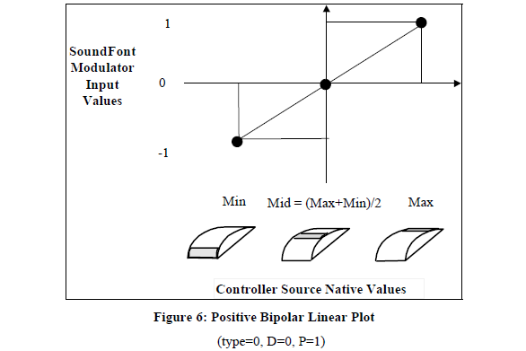

# SoundFont2の仕様書和訳 Modulatorを中心に
2019年3月
sf2の仕様書で特にmodulatorは難解なので和訳しました. 仕様書v2.04に従っています. 以下原文訳


# 0 このドキュメントについて
## 0.1 更新歴
| バージョン | 日付         | 説明                                   |
|-------|------------|--------------------------------------|
| 2.04  | 2002/9/10  | 24bitサンプルのサポート追加                     |
| 2.01  | 1997/8/2   | モジュレーションと標準NRPN実装の仕様を追加              |
| 2.00b | 1997/5/2   | layer/splitの命名をzoneに変更(用語集を参照), 誤字訂正 |
| 2.00a | 1995/10/18 | 初の下書き公開                              |
## 0.2 免責条項
THIS SPECIFICATION IS PROVIDED “AS IS” WITH NO WARRANTIES WHATSOEVER INCLUDING ANY
WARRANTY OF MERCHANTABILITY, FITNESS FOR ANY PARTICULAR PURPOSE, OR ANY WARRANTEE
OTHERWISE ARISING OUT OF ANY PROPOSAL, SPECIFICATION, OR SAMPLE.
A LICENSE IS HEREBY GRANTED TO COPY, REPRODUCE, AND DISTRIBUTE THIS SPECIFICATION FOR
INTERNAL USE ONLY. NO OTHER LICENSE EXPRESS OR IMPLIED, BY ESTOPPEL OR OTHERWISE, TO ANY
OTHER INTELLECTUAL PROPERTY RIGHTS IS GRANTED OR INTENDED HEREBY.
AUTHORS OF THIS SPECIFICATION DISCLAIM ALL LIABILITY, INCLUDING LIABILITY FOR
INFRINGEMENT OF PROPRIETARY RIGHTS, RELATING TO IMPLEMENTATION OF INFORMATION IN THIS
SPECIFICATION. AUTHORS OF THIS SPECIFICATION ALSO DO NOT WARRANT OR REPRESENT THAT
SUCH IMPLEMENTATION (S) WILL NOT INFRINGE ON SUCH RIGHTS. 
この未熟なドキュメントはレビューや提案のコメントを目的のためだけに配布されている. 定期的に更新される. どの製品もこのバージョンのドキュメントには依拠しないべきである.

SoundFont®とSoundFontのロゴはE-mu System, Inc.の商標として登録されたものである. E-mu SystemsはSoundFont Compatibilityのロゴをごく僅かな料金で権利を所有している. 詳細はE-mu SoundFont administrator, FAX (408)439-0392へ. ここにある情報の利用者は商標保有の適切な認可を得て, この仕様に従ったファイルはSoundFont Compatibleであることを明記すること.
## 0.3 更新とコメント
仕様の更新については http://www.soudfont.com へ. コメントは soundfont@emu.com へメールで送ってください.
## 0.4 目次
<!-- TOC -->

- [SoundFont2の仕様書和訳 Modulatorを中心に](#soundfont2の仕様書和訳-modulatorを中心に)
- [0 このドキュメントについて](#0-このドキュメントについて)
    - [0.1 更新歴](#01-更新歴)
    - [0.2 免責条項](#02-免責条項)
    - [0.3 更新とコメント](#03-更新とコメント)
    - [0.4 目次](#04-目次)
- [1 導入](#1-導入)
    - [1.1 このドキュメントの対象と目的](#11-このドキュメントの対象と目的)
    - [1.2 このドキュメントの構造](#12-このドキュメントの構造)
    - [1.3 SoundFont2の目的](#13-soundfont2の目的)
    - [1.4 SoundFont1.x](#14-soundfont1x)
    - [1.5 SoundFont2標準の将来の向上](#15-soundfont2標準の将来の向上)
- [2 用語と省略語](#2-用語と省略語)
    - [2.1 データ構造の用語](#21-データ構造の用語)
    - [2.2 シンセサイザー用語](#22-シンセサイザー用語)
    - [2.3 パラメーター用語](#23-パラメーター用語)
- [3 RIFF構造](#3-riff構造)
    - [3.1 一般のRIFFファイル構造](#31-一般のriffファイル構造)
    - [3.2 SoundFont2のチャンクとサブチャンク](#32-soundfont2のチャンクとサブチャンク)
    - [3.3 RIFF構造の冗長な情報とエラー処理](#33-riff構造の冗長な情報とエラー処理)
- [4 SoundFont2 RIFFファイル形式](#4-soundfont2-riffファイル形式)
    - [4.1 SoundFont2 RIFFファイル形式 Level 0](#41-soundfont2-riffファイル形式-level-0)
    - [4.2 SoundFont2 RIFFファイル形式 Level 1](#42-soundfont2-riffファイル形式-level-1)
    - [4.2 SoundFont2 RIFFファイル形式 Level 2](#42-soundfont2-riffファイル形式-level-2)
    - [4.2 SoundFont2 RIFFファイル形式 Level 3](#42-soundfont2-riffファイル形式-level-3)
    - [4.5 SoundFont2 RIFFファイル形式における型の定義](#45-soundfont2-riffファイル形式における型の定義)
- [5 INFO_listチャンク](#5-info_listチャンク)
    - [5.1 ifilサブチャンク](#51-ifilサブチャンク)
    - [5.2 isngサブチャンク](#52-isngサブチャンク)
    - [5.3 INAMサブチャンク](#53-inamサブチャンク)
    - [5.4 iromサブチャンク](#54-iromサブチャンク)
    - [5.5 iverサブチャンク](#55-iverサブチャンク)
    - [5.6 ICRDサブチャンク](#56-icrdサブチャンク)
    - [5.7 IENGサブチャンク](#57-iengサブチャンク)
    - [5.8 IPRDサブチャンク](#58-iprdサブチャンク)
    - [5.9 ICOPサブチャンク](#59-icopサブチャンク)
    - [5.10 ICMTサブチャンク](#510-icmtサブチャンク)
    - [5.11 ISFTサブチャンク](#511-isftサブチャンク)
- [6 sdta_listチャンク](#6-sdta_listチャンク)
    - [6.1 smplサブチャンクのサンプルデータ形式](#61-smplサブチャンクのサンプルデータ形式)
    - [6.2 sm24サブチャンクのサンプルデータ形式](#62-sm24サブチャンクのサンプルデータ形式)
    - [6.3 サンプルデータのループ規則](#63-サンプルデータのループ規則)
- [7 pdta-listチャンク](#7-pdta-listチャンク)
    - [7.1 HYDRAデータ構造](#71-hydraデータ構造)
    - [7.2 PHDRサブチャンク](#72-phdrサブチャンク)
    - [7.3 PBAGサブチャンク](#73-pbagサブチャンク)
    - [7.4 PMODサブチャンク](#74-pmodサブチャンク)
    - [7.5 PGENサブチャンク](#75-pgenサブチャンク)
    - [7.6 INSTサブチャンク](#76-instサブチャンク)
    - [7.7 IBAGサブチャンク](#77-ibagサブチャンク)
    - [7.8 IMODサブチャンク](#78-imodサブチャンク)
    - [7.9 IGENサブチャンク](#79-igenサブチャンク)
    - [7.10 SHDRサブチャンク](#710-shdrサブチャンク)
- [8 列挙子](#8-列挙子)
    - [8.1 ジェネレーター列挙子と, モジュレーター出力先列挙子](#81-ジェネレーター列挙子と-モジュレーター出力先列挙子)
        - [8.1.1 ジェネレーター列挙子の種類](#811-ジェネレーター列挙子の種類)
        - [8.1.2 ジェネレーター列挙子の定義](#812-ジェネレーター列挙子の定義)
            - [0 : startAddrsOffset](#0--startaddrsoffset)
            - [1 : endAddrsOffset](#1--endaddrsoffset)
            - [2 : startloopAddrsOffset](#2--startloopaddrsoffset)
            - [3 : endloopAddrsOffset](#3--endloopaddrsoffset)
            - [4 : startAddrsCoarseOffset](#4--startaddrscoarseoffset)
            - [5 : modLfoToPitch](#5--modlfotopitch)
            - [6 : vibLfoToPitch](#6--viblfotopitch)
            - [7 : modEnvToPitch](#7--modenvtopitch)
            - [8 : initialFilterFc](#8--initialfilterfc)
            - [9 : initialFilterQ](#9--initialfilterq)
            - [10 : modLfoToFilterFc](#10--modlfotofilterfc)
            - [11 : modEnvToFilterFc](#11--modenvtofilterfc)
            - [12 : endAddrsCoarseOffset](#12--endaddrscoarseoffset)
            - [13 : modLfoToVolume](#13--modlfotovolume)
            - [14 : unused1](#14--unused1)
            - [15 : chorusEffectsSend](#15--choruseffectssend)
            - [16 : reverbEffectsSend](#16--reverbeffectssend)
            - [17 : pan](#17--pan)
            - [18 : unused2](#18--unused2)
            - [19 : unused3](#19--unused3)
            - [20 : unused4](#20--unused4)
            - [21 : delayModLFO](#21--delaymodlfo)
            - [22 : freqModLFO](#22--freqmodlfo)
            - [23 : delayVibLFO](#23--delayviblfo)
            - [24 : freqVibLFO](#24--freqviblfo)
            - [25 : delayModEnv](#25--delaymodenv)
            - [26 : attackModEnv](#26--attackmodenv)
            - [27 : holdModEnv](#27--holdmodenv)
            - [28 : decayModEnv](#28--decaymodenv)
    - [8.2 Modulator Source Enumerators](#82-modulator-source-enumerators)
        - [8.2.1 Source Enumerator Controller Palettes](#821-source-enumerator-controller-palettes)
        - [8.2.2 Source Directions](#822-source-directions)
        - [8.2.3 Source Polarities](#823-source-polarities)
        - [8.2.4 Source Types](#824-source-types)
    - [8.3 Modulator Transform Enumerators](#83-modulator-transform-enumerators)
    - [8.4 Default Modulators](#84-default-modulators)
        - [8.4.1 MIDI Note-On Velocity to Initial Attenuation](#841-midi-note-on-velocity-to-initial-attenuation)
        - [8.4.2 MIDI Note-On Velocity to Filter Cutoff](#842-midi-note-on-velocity-to-filter-cutoff)
        - [8.4.3 MIDI Channel Pressure to Vibrato LFO Pitch Depth](#843-midi-channel-pressure-to-vibrato-lfo-pitch-depth)
        - [8.4.4 MIDI Continuous Controller 1 to Vibrato LFO Pitch Depth](#844-midi-continuous-controller-1-to-vibrato-lfo-pitch-depth)
        - [8.4.5 MIDI Continuous Controller 7 to Initial Attenuation](#845-midi-continuous-controller-7-to-initial-attenuation)
        - [8.4.6 MIDI Continuous Controller 10 to Pan Position](#846-midi-continuous-controller-10-to-pan-position)
        - [8.4.7 MIDI Continuous Controller 11 to Initial Attenuation](#847-midi-continuous-controller-11-to-initial-attenuation)
        - [8.4.8 MIDI Continuous Controller 91 to Reverb Effects Send](#848-midi-continuous-controller-91-to-reverb-effects-send)
        - [8.4.9 MIDIContinuous Controller 93 to Chorus Effects Send](#849-midicontinuous-controller-93-to-chorus-effects-send)
        - [8.4.10 MIDI Pitch Wheel o Initial Pitch Controlled by MIDI Pitch Wheel Sensitivity](#8410-midi-pitch-wheel-o-initial-pitch-controlled-by-midi-pitch-wheel-sensitivity)
    - [8.5 Precedence and Absolute and Relative values](#85-precedence-and-absolute-and-relative-values)
- [9 Parameters and Synthesis Model](#9-parameters-and-synthesis-model)
    - [9.1 Synthesis Model](#91-synthesis-model)
        - [9.1.1 Wavetable Oscillator](#911-wavetable-oscillator)
    - [9.5 The SoundFont Modulator Controller Model](#95-the-soundfont-modulator-controller-model)
        - [9.5.1 Controller Model Theory of Operation](#951-controller-model-theory-of-operation)
    - [9.5.2 Pictorial Examples of Source Types](#952-pictorial-examples-of-source-types)
        - [9.5.3 Mappings of Modulator Sources to the SoundFont Controller Input Domain](#953-mappings-of-modulator-sources-to-the-soundfont-controller-input-domain)
        - [9.5.4 Linked Modulator Description](#954-linked-modulator-description)
    - [9.6 SoundFont2.01 Standard NRPN Implementation](#96-soundfont201-standard-nrpn-implementation)
        - [9.6.1 The NRPN Message](#961-the-nrpn-message)
        - [9.6.2 The NRPN Select Values](#962-the-nrpn-select-values)
        - [9.6.3 The Default Data Entry Ranges](#963-the-default-data-entry-ranges)
    - [9.7 On Implementation Accuracy](#97-on-implementation-accuracy)

<!-- /TOC -->
(訳注: 下の数字は原文のページ番号を表している. これからリンクを作る予定)
FIGURE 1: IDEAL FILTER RESPONSE 47
FIGURE 2: GENERATOR BASED MODULATION STRUCTURE 48
FIGURE 3: SOUNDFONT MODULATOR BUILDING BLOCK 52
FIGURE 4: DETAILED SOUNDFONT MODULATOR BUILDING BLOCK 53
FIGURE 5: POSITIVE UNIPOLAR LINEAR PLOT 55
FIGURE 6: POSITIVE BIPOLAR LINEAR PLOT 55
FIGURE 7: NEGATIVE UNIPOLAR PLOT 56
FIGURE 8: SOUNDFONT MODULATOR SOURCE SUMMARY 57
FIGURE 9: SOUNDFONT MODULATOR CHAINING 58 
# 1 導入 
## 1.1 このドキュメントの対象と目的
このドキュメントはSoundFont2標準の絶対的な情報源である. このドキュメントは任意のユーサーにSoundFont2互換のバンクを正確に作り出したり読み込めるように完全で正確な情報を与えるものとする.  このドキュメントはシンセサイザーの設計や実装についての情報を与える目的ではない.
## 1.2 このドキュメントの構造
このドキュメントでは, セクション1と2はSoundFont2標準の導入部分を説明する. 新規, 熟練の音楽エンジニアにかかわらずセクション2の用語集は目を通して行きたい. セクション3からセクション8はSoundFont2標準のデータ構造について段々と詳しく説明していく. これらのセクションはある場合ではリファレンスとして使われるだろうが, じっくり読むことで理解の段階にかかわらず十分詳しい情報を得られる. セクション9はSoundFont標準がサポートするシンセモデルについて説明しており, シンセエンジンやバンク生成に関わっている人向けである. セクション10はSoundFont互換のバンクを扱う際のエラー処理について説明しており, 主にSoundFont標準に関するプログラミングをしている人向けである. セクション11のアルファベット順の用語集は馴染みがなかったり紛らわしい用語のリファレンスとして使える.
## 1.3 SoundFont2の目的
SoundFont2標準は波形テーブルシンセサイザーのサンプルやアーティキュレーションデータの形式であり拡張, 移植可能で普遍性のある形式を提供する目的がある. この標準は, ジェネレーターやモジュレーターの列挙子を使うことで要求に応じて機能を追加できるようになり, 大きく拡張できるようになっている. この標準は, 簡潔に定義されハードウェアに依存しないバラメーターを利用したり, 幅広い技術へのサポートをするために設計された特別な実践例があり, 移植性や普遍性を持っている.
## 1.4 SoundFont1.x
SoundFont標準はEMU8000シンセチップを利用しているCreative Labs AWE32の形で1.0としてリリースされた. この特有の形式は大きな成功を示したがこの経験でいくつかの改良を重ねた. 最初は上方互換での改良が1.5まで進められた.

しかし, 公開のダウンロードできる音源をやり取りする形式の需要が増したことで, Creative TechnologyはSoundFont形式を公開することがSoundFontにとって一番の利益になると決定した. まだまだ改良が必要であるので, 多くの部分は完全に互換性を持つようにサポートできなかったため, Creativeは公開に伴って改良版の形式への道をたどることにした. その結果, SoundFont2標準が誕生した.

SoundFont2にはいくつかの主要な向上がある. 1つ目に, プリセットレベルでの相対的なパラメーターの利用である. これによってインストゥルメントは一貫性を変えることなく調整でき, ユーザーは簡単に効果的にインストゥルメントの編集ができる. 2つ目に, サンプル自身のデータ構造が改良され, サウンドデザイナーは難なくサンプルを再利用可能にするための主要な情報が得られる. サンプルデータ製品の規格の具体化が増したことで様々なサウンドエンジンへ移植性が向上した. 最後に, モジュレーターの追加によって現在, 将来の波形テーブルシンセサイザーの一般的な機能を全て表現できる凄まじい構造が生み出された.
## 1.5 SoundFont2標準の将来の向上
SoundFont2標準は将来の波形テーブルシンセ技術性能に合わせた向上を, ジェネレーターやモジュレーターの列挙子を追加することで実現が可能になるよう設計されている. これは上方互換を保つように行われる. これらの追加の提案は soundfont@emu.com へEメールで. 基本的に, 仕様の更新に関するポリシーは技術的な理想論ではなく消費者の需要に基づく.

SoundFont2標準は数年内に双方互換性を保つと見込んでいる.
# 2 用語と省略語
続くセクションはこの仕様書で使われている用語を論理的な順番で紹介する. これは波形テーブルシンセの実装の詳細に馴染みがない人への導入として, または専門家への見直しやリファレンスとしての用途のためでもある. この仕様書最後にある索引用の用語集でも, ここにある用語や他の用語, 省略語が調べられる.
## 2.1 データ構造の用語
bag : SoundFontデータ構造の要素で, プリセットゾーンのリストまたはインストゥルメントゾーンのリストを保有している.

big endian(ビッグエンディアン) : ワード内のバイトのメモリ構造のうち, MSB(最上位バイト)が手前のアドレスにくるもの. リトルエンディアンの反対.

byte : 8個のbitからなるデータ構造の要素, これらのbitに意味は定義されていない.

BYTE : 8個のbitからなるデータ構造の要素, 0から255のunsigned valueをもつ.

case-insensitive(ケースインセンシティブ) : ASCII文字や文字列のアルファベットの大文字小文字を区別しない.

case-sensitive(ケースセンシティブ) : ASCII文字や文字列のアルファベットの大文字小文字を区別する. 

CHAR : 8つのbitからなるデータ構造の要素, -128から+127のsigned valueをもつ.

chunk(チャンク) : RIFFファイルの最上位の階層のこと.

doubleword : 32個のbitからなるデータ構造の要素, これらのbitに意味は定義されていない.

DWORD : 32個のbitからなるデータ構造の要素, 0から4,294,967,295のunsigned valueを持つ.

enumerated(列挙) : デーひタ要素のうちシンボルが特有の機能に対応するもの.

global(グローバル) : 関連する構造全体に影響を与えるバラメーターの性質. global zoneをみよ.

global zone(グローバルゾーン) :  そのオブジェクト内の他のゾーン全てに影響を与える, ジェネレーターやモジュレーターのゾーン.

header : SoundFontの要素についてのいくつかの側面を記述するデータ構造の要素.

hydra : 1, 9頭をもつ神話のビースト. 2, SoundFontのアーティキュレーションデータを構成する9つのpdtaサブチャンク

instrument(インストゥルメント) : SoundFont標準では, 1つのミュージックインストゥルメントの音やサウンドエフェクトセットを表すゾーンの集まりを意味する.

instrument zone : サンプルの参照や関連のアーティキュレーションデータを保有する集合で, あるkey numberとvelocityの再生をするために定められる.

layer : 使われなくなったSoundFontの用語で, 現在はプリセットゾーンと呼ばれる.

level(レベル) : SoundFontの構造では, プリセットや, プリセットゾーン(プリセットレベル), インストゥルメントや, インストゥルメントゾーン(インストラメントゾーン) のどれかを指す.

little endian(リトルエンディアン) : ワード内のバイトのメモリ構造のうち, MSB(最上位バイト)が後のアドレスにくるもの. リトルエンディアンの反対.

object(オブジェクト) : level(プリセットもしくはインストゥルメント)に応じてインストゥルメントもしくはプリセットのことを指す.

orphan :  普通は上のレベルから参照されているデータ構造の中でも特にどこからも参照されていないもの. 特に, どのプリセットゾーンからも参照されていないインストゥルメントや, どのインストゥルメントゾーンからも参照されていないサンプルのことを指す.

preset(プリセット) : キーボードのための一式のサウンド. 一般的にはサンプルやアーティキュレーションデータの集まりでありMIDIのプリセットナンバーに関連づけられる.

preset zone(プリセットゾーン) : インストラメントの参照とそれに関連づけられたアーティキュレーションデータの集合でありあるkey numberやvelocityを再生するために定められる.

record(レコード) : データ構造の1つのインスタンス

RIFF : Resource Interchange File Formatの略. SoundFont互換ファイルのように, Microsoft OSで流通するファイルに対して推奨される形式.

SHORT : 16個のbitからなるデータ構造の要素, -32,768から+32,767のsigned valueをもつ.

split : 使われなくなったSoundFontの用語, 現在のインストラメントゾーンにあたる.

sub-chunk(サブチャンク) : RIFFファイルのチャンクの下にある部分

terminator(ターミネーター) : データ構造の要素で列の最後であることを示すもの.

WORD : 16個のbitからなるデータ構造の要素, 0から65535のunsigned valueをもつ.

word : 16個のbitからなるデータ構造の要素, これらのbitに意味は定義されていない.

zone(ゾーン) : オブジェクトとそれに関連づけられたアーティキュレーションデータであり, あるkey numberやvelocityで再生されるもの.

## 2.2 シンセサイザー用語 
articulation(アーティキュレーション) : 表現豊かな音のノートを生み出すために振幅, ピッチ, 音色のモジュレーションをする過程のこと.

artifact : (一般的に望ましくない)音の現象, 元の音ではないものとわかるもの.

attack(アタック) : エンベロープやサウンドの段階の1つであり, 振幅が0からピークまで上がるまでの段階.

attenuation(減衰) : ボリュームやシグナルの振幅の減少.

AWE32 : Creative TechnologyオリジナルのSound Blaster製品であり, EMU8000波形テーブルシンセサイザーを持ちSoundFont標準をサポートした.

balance : ステレオボリュームコントロールの形式で, コントロールが中央の時の左右のチャンネルの最大がどの程度になるかを示し, どちらか一方に完全に寄っている時はもう一方側のチャンネルのみを減衰する.

bank(バンク) : プリセットの集まり. MIDIバンクも参照せよ.

chorus(コーラス) : 循環的にシグナルのピッチをシフトさせて元の音と混ぜ合わせ, 時間可変のcomb filterを生成するアルゴリズム, 生み出された音は動きや迫力感を感じさせる

cutoff frequency(カットオフ周波数) : フィルター機能の周波数のうち, 減衰が定められた値に達する周波数.

data points(データポイント) : サンプルを構成する個々の値. サンプルポイントとも呼ばれる. サンプルの反対.

decay(ディケイ) : エンベロープやサウンドの段階の1つであり, 振幅がピークから安定するまでの段階.

delay(ディレイ) : エンベロープやLFO機能の段階の1つであり, key-onイベント発生から振幅が0じゃなくなるまでの段階.

DC gain(DCゲイン) : システムが安定, もしくは周波数やシグナルが0でいられる増幅や減衰の量

digital audio : 時間均等に量子化された値の列によるオーディオ. これらの値はサンプルデータポイントと呼ばれる.

downloadable : ファイルからRAMへロードされるサンプルのこと, ROMで維持されるものの反対.

dry : リバーブやコーラスのようなどのエフェクトプロセシングもかかっていないオーディオ.

EMU8000 : E-mu Systemが設計したCreative Technology製品向けの波形シンセサイザーチップ.

envelope(エンベロープ) : 時間可変のシグナルで一般的にピッチ, ボリューム, ノートのフィルターカットオフ周波数をコントロールし, アタック, ディケイ, サステイン, リリースの段階を含む

flat : 1, あるトーンよりもピッチが低いトーンのことを言う. 2, オーディオのレンジのある一定値から動かない周波数の反応のことを言う.

interpolator : 既にあるサンプルデータポイントの補完を計算する回路やアルゴリズム. 波形テーブルシンセサイザーのピッチシフト操作で特に使われ, 補完ポイントは好きなピッチ転移波形のサンプルポイント出力を表す.

key number : MIDI key nuberを参照せよ.

LFO : Low Frequency Oscillatorの略語. 遅い周期のモジュレーションソース.

linear coding : 最も知られているデジタルオーディオ振幅エンコーディングの方法であり, それぞれのステップのサイズが等しい.

loop(ループ) : 波形テーブルシンセでは, 持続時間を伸ばすためにたくさん繰り返されるサンプルの部分.

loop points(ループポイント) : ループの最初と最後のサンプルデータポイント.

lowpass(ローパス) : 高周波数のみ減衰し低周波数は減衰しないフィルターの性質.

MIDI : Musical Instrument Digital Interface の頭字語. 音楽シンセサイザーに演奏情報を送る標準プロトコル.

MIDI bank : 最大128のプリセットのグループであり, MIDI change bankコマンドで選択される.

MIDI continuous controller : MIDIプロトコルの構文.

MIDI key number : MIDIプロトコルの構文, MIDI key-onやkey-offコマンドに伴い, そのコマンドで指定される音源楽器キーポードのキーを指定する.

MIDI pitch bend : MIDIプロトコルの特別な構文, MIDI continuous controllerと同種, MIDI channelで演奏される全てのノートのピッチのリアルタイムでの値をコントロールする.

MIDI preset : あるMIDI channelでアクティブなものとして選ばれたプリセット. MIDI change presetコマンドで選ばれる.

MIDI velocity : MIDIプロトコルの構文, MIDI key-onやkey-offコマンドに伴い, キーが打鍵されたり離されるスピードを指定する.

mono : monophonicの略語. ただ1つのチャンネルや波形からなるサウンドの性質を指す. stereoの反対.

Oscillator(オシレーター) : 波形テーブルシンセでは, 波形テーブルインターポレーターはオシレーターと見なされる.

pan : panoramaの略語. 音が出ていると感じる方向を左から右へ180度コントロールする. 左と右のスピーカーの音量を変えることで実現される.

pitch : 周波数を知覚した値. 一般的に周波数と相互的に使える.

pitch shift : ピッチの変化. 波形テーブルシンセサイザーはサンプルのピッチシフトをするときに補完機能を使うことでスケールのノートを生成する.

pole(極) : フィルター変換解析で使われる数学用語. シンセでは, poleは1オクターブ6dBのロールオフに等しく, フィルターのロールオフはpoleで指定される.

Preditor : E-muSystemによるのSoundFont2.00互換バンク編集ソフトウェア

preset(プリセット) : キーボードのための一式のサウンド. 一般的にはサンプルやアーティキュレーションデータの集まりでありMIDIのプリセットナンバーに関連づけられる.

Q : フィルター変換解析で使われる数学用語. フィルターのレゾナンスの量を表す. シンセ用語では, レゾナンスの類語.

release : エンベロープやサウンドの段階の1つであり, 振幅が安定状態から0になったり聞こえなくなるまでの段階.

resonance(レゾナンス, 共振) :  フィルターの性質の一つで, 特定の周波数が他の周波数よりも強調されること. レゾナンスはDCゲインよりも高い値の範囲でdBで測定される.

resonant frequency(レゾナント周波数, 共振周波数) : レゾナンスが最大に達する周波数.

reverb(リバーブ) : reverberationの略. シンセ用語としては, 人工的に立体感や雰囲気を加えるシンセシグナルプロセッサー

sample(サンプル) : サンプルデータポイントの意味で使われたり, それらのポイントが集まりでデジタルオーディオ波形を構成するものを意味することもある. この仕様書では後者の意味でのみ使われる.

soft : ピアノのペダルの1つ, ダンパーを下げてノートの音色や音量をソフトにすることから由来する.

sostenuto(ソステヌート) : ピアノのペダルの1つ, 押されているキーのダンパーをそのままペダルが離されるまで保ち続ける. MIDIでは, continuous controller 66がこの役割をする.

sustain(サステイン) : ピアノのペダルの1つ, 押されたキーのダンパー全てが離れるのを防ぐ. MIDIでは, continuous controller 64がこの役割をする.

SoundFont : E-mu Systems, Incの商標登録でSoundFont技術仕様に従ったファイル, データ,シンセサイザー, E-muが製造したハードウェアやソフトウェアを指す.

SoundFont Compatible : SoundFont技術仕様に従ったファイル, データ,シンセサイザー, E-muが製造したハードウェアやソフトウェアを指す.

stereo : 一般的には3次元を意味する. この仕様書では, この用語は2チャンネルステレオを意味し, 音が2つの独立したオーディオチャンネル , 左と右で音響効果をつける. monophinicの反対.

synthesis engine(シンセエンジン) : シンセサイザーのシグナルプロセシングとモジュレーションパスに関係するハードウェアやソフトウェア

synthesizer(シンセサイザー) : 理想上どんなサウンドも出せる装置

tremolo(トレモロ) : サウンドの振幅を周期的に変化させること. 一般的にLFOをファイナルポリュームアンプリファイアーに作用させることで生み出される.

triangular(三角波) : まず最大値に向かって傾いてから対称的な最小値に向かって傾く波形  

unpitched(非音程) : 周波数て表せないサウンド. ノイズのようなインストゥルメントやサウンドエフェクトに対して言う.

velocity(ベロシティ) : シンセ用語では, キーポードの鍵盤が押される速さのこと. 一般的に演奏者の打鍵の衝撃の強さに比例する.

vibrato(ビブラート) : サウンドのピッチの周期的な変化のこと. 一般的にLFOをオシレーターピッチに作用させることで生み出される.

volume(ボリューム) : サウンドの音量や振幅もしくはこのパラメーターのコントロールのこと.

wavetable(波形テープル) : 音楽シンセ技術の1つ, サウンドが録音されたり数学的に計算されて, メモリに配置され, 好きなピッチを生み出すために可変レートで再生される. アンプ, フィルター, リバーブやコーラスなどのエフェクトプロセシングを利用してサウンドの音色の調整がなされることが多い.

## 2.3 パラメーター用語 
absolue(絶対的) : 決定的な実際の値を与えるパラメーターの性質. relativeの反対.

additive(加法的) : 他のバラメーターに数値が加算されるパラメーターの性質.

attenuation(減衰) : シグナルの振幅やボリュームの減少

bipolar : 最小値が-1で最大値が1のコントローラー. unipolarの反対.

cent(セント) : 2の1200乗根を1単位とするピッチ比の単位. 半音の100分の1, 約1.000577790.

centibel(センチベル, cB) : 10の200乗根を1単位とする振幅比の単位. 10分の1デシベル, 約1.011579454.

cutoff frequency(カットオフ周波数) : フィルター機能の周波数のうち, 減衰が定められた値に達する周波数.

decibel(デシベル, dB) : 10の20乗根を1単位とする振幅比の単位. 約1.122018454.

octave(オクターブ) : 比率を2の指数乗で表すときの指数部分, 一般的にピッチや周波数に適用される. 
(訳注: 3octaveなら2^3=8倍の比率となる)

pitch(ピッチ) : 周波数を知覚した値. 一般的に周波数と相互的に使える.

pitch shift : ピッチの変化. 波形テーブルシンセサイザーはサンプルのピッチシフトをするときに補完機能を使うことでスケールのノートを生成する.

relative(相対的) : ある確立された値からのオフセットを表すパラメーターの性質. absoluteの反対.

resonance(レゾナンス, 共振) :  フィルターの性質の一つで, 特定の周波数が他の周波数よりも強調されること. レゾナンスはDCゲインよりも高い値の範囲でdBで測定される.

sample rate(サンプルレート) : サンプルの録音時にとるサンプルデータポイントの数, Hz単位で表す.

semitone(半音) : 2の12乗根を1単位とするピッチ比の単位. 1オクターブの12分の1, 約1.059463094.

sharp : 他の参照されたトーンよりピッチが高いトーンの性質.

timecent(タイムセント) : 2の1200乗根を1単位とする時間の長さの単位. オクターブの1200分の1. 約1.000577790.

unipolar(単極) : 最小値が0で最大値が1のコントローラー. bipolarの反対.

# 3 RIFF構造
## 3.1 一般のRIFFファイル構造
RIFF (Resource Intercahnge File Format) はマルチメディアのリソースファイルのために開発されたタグ付きファイル構造で, Microsoft Windows SDK Multimedia Programmer's Referenceにいくつか詳細が記述されている. タグ付きファイル構造は, 時間が経ちファイルの定義が変更された時に互換性の問題を防ぐ点で有効である. ファイルの1つ1つのデータは標準ヘッダーで識別されるため, データの要素を認識できないアプリケーションは未知の情報をスキップできる.

RIFFファイルはchunk(チャンク)と呼ばれるブロックから構成される. C言語の構文では, チャンクは次で定義される:
```c
typedef DWORD FOURCC; //4文字のコード

typedef struct {
    FOURCC  ckID;   //チャンクIDはチャンク内のデータのタイプを識別する
    DWORD   ckSize; // padバイトを除くチャンクデータのサイズ
    BYTE    ckDATA[ckSize]; //実際のデータと必要ならば終端処理のpadバイト
};
```
2つのタイプのチャンク:RIFFチャンクとLISTチャンクはサブチャンクと呼ばれる入れ子のチャンクをデータとして含んでよい.

RIFFファイルのチャンクとサブチャンクの優先順位は, RIFFファイル形式ではちゃんと記述されていない. SoundFont2.0では, INFOチャンク内のサブチャンクの順番は任意であるが, 一貫性のためにこれらのサブチャンクはこのドキュメントで示された通りに並べることが推奨される. 他のチャンクやサブチャンクの順番は厳密に定められ, ドキュメントで示される通りでなくてはならない.

## 3.2 SoundFont2のチャンクとサブチャンク
SoundFont2互換のRIFFファイルはINFO_listチャンク, sdta_listチャンク, pdta_listチャンクの3つのチャンクからなる. INFO_listチャンクはファイル, 履歴, 使用目的について記述するいくつかの必須や任意のサブチャンクを含む. sdta_listチャンクは1つのサブチャンクからなり, 参照される全てのデジタルオーディオサンプルを含む. pdta_listチャンクは9個のサブチャンクを含み, デジタルオーディオデータのアーティキュレーションを定義する.

SoundFont標準ではINFO_listチャンク内のサブチャンクは順不同である. しかし, 3つのチャンク, pdta_list内のサブチャンクの順番は指定されている.

SoundFont2仕様ではINFO_listチャンク内の未知のサブチャンクは無視する実装が要求される.  しかし, そのようなサブチャンクがこの仕様で定義されるまでは, INFO_listへ未知のサブチャンクの追加をするとSoundFont標準から外れたものとなる.

SoundFont2のRIFF構造の詳細はセクション4にある.

## 3.3 RIFF構造の冗長な情報とエラー処理
RIFFファイル構造はファイル, チャンク, サブチャンクそれぞれの長さに関する冗長な情報を含んでいる. これによってSoundFont互換ファイルの読み込み時にファイルがデータ欠損しているかを判別できる.

もしそのような欠損が見つかれば, SoundFont互換ファイルは"structurally unsound"と呼ばれ, 通常は拒絶されるものとする. SoundFont互換ソフトの開発者は"structurally unsound"ファイルからデータを復元して正規のSoundFont2互換ファイルを作り出すツールを開発しても良い. 復元する時に, ユーザーの介入があったりなかったりする.

# 4 SoundFont2 RIFFファイル形式
(訳注: 原文ではこのセクションはSAOL構文というBNF構文を独自に拡張したもので構造が記述されているが, そんな特殊な構文はMarkdown形式で扱えないので箇条書きなどを使って記述している. ":=" の後が空白の場合は改行で続いていることに注意せよ. RIFFファイルの構造についてある程度知識を持ってから読むことを推奨. )
## 4.1 SoundFont2 RIFFファイル形式 Level 0

SFBK_form := 
+ RIFF 'sfbk'--------RIFF形式ヘッダー
    * INFO_list------補足の情報   
    * sdta_list------サンプルバイナリデータ
    * pdta_list------プリセット, インストゥルメント, サンプルヘッダーのデータ

## 4.2 SoundFont2 RIFFファイル形式 Level 1
INFO_list :=
+ LIST 'INFO'
    * ifil_ck--------SoundFont RIFFファイルのバージョン
    * isng_ck--------サウンドエンジン
    * INAM_ck--------SoundFontバンクの名前
    * [irom_ck]------サウンドROMの名前 
    * [iver_ck]------サウンドROMのバージョン
    * [iCRD_ck]------バンク作成日
    * [IENG_ck]------サウンドデザイナー, エンジニアの名前
    * [IPRD_ck]------バンクの目的
    * [ICOP_ck]------コピーライト
    * [ICMT_ck]------バンクのコメント
    * [ISFT_ck]------バンク作成・編集ソフト

sdta_ck :=
+ LIST 'sdta'
    * [smpl_ck]------デジタルオーディオサンプル上位16bit
    * [sm24_ck]------デジタルオーディオサンプル下位8bit

pdta_ck :=
+ LIST 'pdta'
    * phdr_ck--------プリセットヘッダー達
    * pbag_ck--------プリセットのインデックスリスト
    * pmod_ck--------プリセットのモジュレーターリスト 
    * pgen_ck--------プリセットのジェネレーターリスト
    * inst_ck--------インストゥルメント名とインデックス達
    * ibag_ck--------インストゥルメントのインデックスリスト
    * imod_ck--------インストゥルメントのモジュレーターリスト
    * igen_ck--------インストゥルメントのジェネレーターリスト
    * shdr_ck--------サンプルヘッダー達

## 4.2 SoundFont2 RIFFファイル形式 Level 2
ifil_ck := ifil(iver_rec)------------e.g. 2.01
isng_ck := isng(szSoundEngine:ZSTR)--e.g. "EMU8000"
irom_ck := irom(szROM:ZSTR)----------e.g. "1MGM"
iver_ck := iver(iver_rec)------------e.g. 2.08
INAM_ck := INAM(szName:ZSTR)---------e.g. "General MIDI"
ICRD_ck := ICRD(szDate:ZSTR)---------e.g. "July 15, 1997"
IENG_ck := IENG(szName:ZSTR)---------e.g. "John Q. Sounddesigner"
IPRD_ck := IPRD(szProduct:ZSTR)------e.g. "SBAWE64 Gold"
ICOP_ck := ICOP(szCopyright:ZSTR)----e.g. "Copyright (c) 1997  E-mu Systems, Inc."
ICMT_ck := ICMT(szComment:ZSTR)------e.g. "This is a comment"
ISFT_ck := ISFT(szTools:ZSTR)--------e.g. ":Preditor 2.00a:Vienna SF Studio 2.0:"

smpl_ck := smpl(smpl:SHORT)----------デジタルオーディオデータの16bit固定長エンコード

phdr_ck := phdr(phdr_rec)
pbag_ck := pbag(pbag_rec)
pmod_ck := pmod(pmod_rec)
pgen_ck := pgen(pgen_rec)
inst_ck := inst(inst_rec)
ibag_ck := ibag(ibag_rec)
imod_ck := imod(imod_rec)
igen_ck := igen(igen_rec)
shdr_ck := shdr(shdr_rec)
## 4.2 SoundFont2 RIFFファイル形式 Level 3
```c
struct sfVersionTag
{
    WORD wMajor;
    WORD wMinor;
} iver_rec;

struct sfPresetHeader
{
    CHAR achPresetName[20];
    WORD wPreset;
    WORD wBank;
    WORD wPresetBagNdx;
    DWORD dwLibrary;
    DWORD dwGenre;
    DWORD dwMorphology;
} phdr_rec;

struct sfPresetBag
{
    WORD wGenNdx;
    WORD wModNdx;
} pbag_rec;

struct sfModList
{
    SFModulator sfModSrcOper;
    SFGenerator sfModDestOper;
    SHORT modAmount;
    SFModulator sfModAmtSrcOper;
    SFTransform sfModTransOper;
} pmod_rec;

struct sfGenList
{
    SFGenerator sfModDestOper;
    genAmountType genAmount;
} pgen_rec;

struct sfInst
{
    CHAR achInstName[20];
    WORD wInstBagNdx;
} inst_rec;

struct sfInstBag
{
    WORD wInstGenNdx;
    WORD wInstModNdx;
} ibag_rec;

struct sfInstModList
{
    SFModulator sfModSrcOper;
    SFGenerator sfModDestOper;
    SHORT modAmount;
    SFModulator sfModAmtSrcOper;
    SFTransform sfModTransOper;
} imod_rec;

struct sfInstGenList
{
    SFGenerator sfGenOper;
    genAmountType genAmount;
} igen_rec;

struct sfSample
{
    CHAR achSampleName[20];
    DWORD dwStart;
    DWORD dwEnd;
    DWORD dwStartloop;
    DWORD dwEndloop;
    DWORD dwSampleRate;
    BYTE byOriginalKey;
    CHAR chCorrection;
    WORD wSampleLink;
    SFSampleLink sfSampleType;
} shdr_rec;
```
## 4.5 SoundFont2 RIFFファイル形式における型の定義
sfModulator型, sfGenerator型, sfTransform型は全て列挙型で, 続くセクションで定義される.

genAmountTypeはunion(共用体)で signed 16bit, unsigned 16bit, 2つの unsigned 8bitフィールドが使われる.
```c
typedef struct
{
    BYTE byLo;
    BYTE byHi;
} rangesType;

typedef union
{
    rangesType ranges;
    SHORT shAmount;
    WORD wAmount;
} genAmountType;
```
SFSampleLinkは列挙型で, sampleの種類(モノラル, ステレオ, 左など)や, RAMとROMどちらに配置されているかを記述する.

```c
typedef enum
{
    monoSample = 1,
    rightSample = 2,
    leftSample = 4,
    linkedSample = 8,
    RomMonoSample = 0x8001,
    RomRightSample = 0x8002,
    RomLeftSample = 0x8004,
    RomLinkedSample = 0x8008
} SFSampleLink;
```
# 5 INFO_listチャンク
SoundFont2互換ファイルのINFO_listチャンクには3つの必須サブチャンクと様々な任意サプチャンクがあり, 以下で定義される. INFO_listチャンクからファイル内のSoundFont互換バンクの基本的な情報が得られる. 
## 5.1 ifilサブチャンク
ifilサプチャンクは必須サブチャンクで, ファイルのSoundFont仕様のバージョンを識別する. 必ず4バイト長で, 次のデータ構造を持つ.
```c
struct sfVersionTag
{
    WORD wMajor;
    WORD wMinor;
};
```
WORD wMajorはSoundFont仕様のバージョンの小数点の左側の数となる. WORD wMinorは小数点の右側の数となる. 例えば, バージョン2.11ならばwMajor = 2, wMinor = 11となる.

これらの値はSoundFont互換ファイルを読み込むアプリケーションに使われ, ファイルの形式がプログラムで扱えるのかを判断できる. wMajorが同じならば, この形式の変更はGeneratorや, SourceとTransform列挙型, infoサプチャンクの追加のみになる予定である. これら全てはプログラムが未知ならば無視されるように定義されている. よって, wMajorが同じならば多くのアプリケーションは上方互換となるように設計できる. エディタや全ての列挙型の情報を要するプログラムの場合はwMinorの値に伴って変更しなくてはならない. 基本的にアプリケーションプログラムはファイルを有効な(適切に解釈できる)ものとして受け付けるか, 無効なものとして拒絶するか, ユーザーにファイル内で取り扱えないデータがあると警告するかのどれかをする.

もしifilサブチャンクがなかったり4バイトでないならば, ファイルはstructually unsoundとして拒絶されるものとする.
## 5.2 isngサブチャンク
isngサプチャンクは必須サブチャンクで, ファイルが最適化されている波形テーブルサウンドエンジンを識別する. 256文字以下のASCII文字列 (1つか2つの0終端文字を含み, バイトが偶数個になるようにする) が入る. デフォルトのisngフィールドは8バイト長の"EMU80000"であり7文字のASCII文字に1つの値0のバイトが続いたものとなる. 

ASCIIは大文字と小文字を区別する. つまり, "emu8000" は "EMU8000" とは等しくない.

isng文字列を調べることで対象サウンドエンジンに応じてチップドライバーのシンセアルゴリズムで最適なものを選ぶことができる.

もしisngサブチャンクがなかったり終端が0でなかったり, 未知のサウンドエンジンならば, isngフィールドは無視されEMU8000として扱われるものとする.
## 5.3 INAMサブチャンク
INAMサプチャンクは必須サブチャンクで, SoundFont互換バンクの名前を与える. 256文字以下のASCII文字列 (1つか2つの0終端文字を含み, バイトが偶数個になるようにする) が入る. 典型的にINAMサブチャンクは14バイト長の"General MIDI"であり12文字のASCII文字列に2つの値0のバイトが続いたものとなる.

典型的にinam文字列はファイル名の変更に左右されない識別子として使われる.

もしinamサプチャンクがなかったり, 終端が0でないならば, inamフィールドは無視され, もし参照されたならユーザーに適切なエラーメッセージが与えられるものとする. ファイルが上書きされるなら, INAMフィールドに有効な名前を入れるものとする. 
## 5.4 iromサブチャンク
iromサプチャンクは任意サブチャンクで, ROMサンプルが参照する波形テーブルサウンドデータROMを識別する. 256文字以下のASCII文字列 (1つか2つの0終端文字を含み, バイトが偶数個になるようにする) が入る. 典型例として, iromフィールドは6バイト長で"1MGM"であり4文字のASCII文字に2つの値0のバイトが続いたものとなる. 

ASCII文字列は大文字と小文字を区別する. つまり, "1mgm" と "1MGM"は等しくない.

ドライバーがirom文字列を使って, ファイルが参照しているROMデータがそのサウンドエンジンで使えるのかを確認するのに使われる.

もしiromサブチャンクがなかったり, 終端が0でなかったり, 内容が未知のROMである場合は, iromフィールドは無視されファイルはROMサンプルへ参照しないものとして扱われるものとする. その状態でROMサンプルが参照されれば, そのインストゥルメントへの参照は終了し音がならないものとする. 2つの有効なiromとiverがない場合, ROMサンプルに参照するファイルは作成できないものとする.
## 5.5 iverサブチャンク
iverサプチャンクは任意サブチャンクで, ROMサンプルが参照する波形テーブルサウンドデータROMのバージョンを識別する. 必ず4バイト長で次のデータ構造を持つ: 
```c
struct sfVersionTag
{
    WORD wMajor;
    WORD wMinor;
}
```
WORD wMajorはSoundFont仕様のバージョンの小数点の左側の数となる. WORD wMinorは小数点の右側の数となる. 例えば, バージョン1.36ならばwMajor = 1, wMinor = 36となる.

ドライバーがiver文字列を使って, ファイルが参照しているROMデータがサウンドヘッダーが指定した正しい場所に配置されているかを確認するのに使われる.

もしiverサブチャンクがなかったり, 4バイト長でなかったり, 内容が未知や不正なROMである場合は, iverフィールドは無視されファイルはROMサンプルへ参照しないものとして扱われるものとする. その状態でROMサンプルが参照されれば, そのインストゥルメントへの参照は終了し音がならないものとする. 2つの有効なiromとiverがない場合, ROMサンプルに参照するファイルは作成できないものとする.
## 5.6 ICRDサブチャンク
iverサプチャンクは任意サブチャンクで, SoundFont互換バンクの作成日を識別する. 256文字以下のASCII文字列 (1つか2つの0終端文字を含み, バイトが偶数個になるようにする) が入る. 典型例として, ICRDフィールドは12バイト長の"May 1, 1995"であり11個のASCII文字と1つの値0のバイトが続いたものとなる. 

慣習では, 文字列の形式は"Month Day, Year"で, Monthは1文字目が大文字で, そのMonthのフルスペルとなり, Dayは日の後に',' (コンマ)を続け, Yearはフルの西暦となる. よって慣習ではICRDフィールドは32バイトより長くならないものとする.

ICRD文字列はライブラリ管理の目的で与えられる.

もしICRDサブチャンクがなかったり, 終端が0でなかったり, 何らかの理由で忠実にASCII文字列としてコピーできないものは, ICRDフィールドは無視され, 上書きする場合はコビーされないものとする. もしICRDフィールドが一見意味を成していないが忠実に再現できる場合はそうするものとする.
## 5.7 IENGサブチャンク
IENGサプチャンクは任意サブチャンクで, そのSoundFont互換バンクに関わっているサウンドデザイナー・エンジニアの名前を識別する. 256文字以下のASCII文字列 (1つか2つの0終端文字を含み, バイトが偶数個になるようにする) が入る. 典型例として, IENGフィールドは12バイト長の"Tim Swartz"であり10個のASCII文字と2つの値0のバイトが続いたものとなる. 

IENG文字列はライブラリ管理の目的で与えられる.

もしIENGサブチャンクがなかったり, 終端が0でなかったり, 何らかの理由で忠実にASCII文字列としてコピーできないものは, ICRDフィールドは無視され, 上書きする場合はコビーされないものとする. もしIENGフィールドが一見意味を成していないが忠実に再現できる場合はそうするものとする.
## 5.8 IPRDサブチャンク
IPRDサブチャンクは任意サブチャンクで, SoundFont互換バンクが対象とする特有の製品を識別する. 256文字以下のASCII文字列 (1つか2つの0終端文字を含み, バイトが偶数個になるようにする) が入る. 典型例として, IPRDサブチャンクは8バイト長の"SBAWE32"であり7個のASCII文字に1つの0が続いたものとなる. 

ASCII文字列は大文字と小文字を区別する. つまり "sbawe32" は "SBAWE32"と等しくない.

IPRD文字列はライブラリ管理の目的で与えられる.

もしIPRDサブチャンクがなかったり, 終端が0でなかったり, 何らかの理由で忠実にASCII文字列としてコピーできないものは, IPRDフィールドは無視され, 上書きする場合はコビーされないものとする. もしIPRDフィールドが一見意味を成していないが忠実に再現できる場合はそうするものとする.

## 5.9 ICOPサブチャンク
ICOPサブチャンクは任意サブチャンクで, SoundFont互換バンクに関連するコピーライトの主張する. 256文字以下のASCII文字列 (1つか2つの0終端文字を含み, バイトが偶数個になるようにする) が入る. 典型例として, ICOPサブチャンクは40バイト長の"Copyright (c) 1995 E-mu Systems, Inc."であり38個のASCII文字に2つの0が続いたものとなる. 

ICOPは知的財産保護や管理の目的で与えられる.

もしICOPサブチャンクがなかったり, 終端が0でなかったり, 何らかの理由で忠実にASCII文字列としてコピーできないものは, IPRDフィールドは無視され, 上書きする場合はコビーされないものとする. もしICOPフィールドが一見意味を成していないが忠実に再現できる場合はそうするものとする.
## 5.10 ICMTサブチャンク
ICMTサブチャンクは任意サブチャンクで, SoundFont互換バンクに関連するコメントである. 256文字以下のASCII文字列 (1つか2つの0終端文字を含み, バイトが偶数個になるようにする) が入る. 典型例として, ICMTサブチャンクは40バイト長の"This space unintentionally left blank."であり38個のASCII文字に2つの0が続いたものとなる.

ICMT文字列は下品でない使用のために与えられる.

もしICMTサブチャンクがなかったり, 終端が0でなかったり, 何らかの理由で忠実にASCII文字列としてコピーできないものは, IPRDフィールドは無視され, 上書きする場合はコビーされないものとする. もしICMTフィールドが一見意味を成していないが忠実に再現できる場合はそうするものとする.
## 5.11 ISFTサブチャンク
ISFTサブチャンクは任意サブチャンクで, SoundFont互換バンクを作成したり最新の変更で使用したツールを識別する. 256文字以下のASCII文字列 (1つか2つの0終端文字を含み, バイトが偶数個になるようにする) が入る. 典型例として, ISFTサブチャンクは30バイト長の"Preditor 2.00a:Preditor 2.00a"であり29個のASCII文字に1つの0が続いたものとなる.

ASCII文字列は大文字と小文字を区別する. つまり, "Preditor" は "PREDITOR" と等しくない.

慣習では, ツール名やリビジョン番号は作成ツールのものが最初で最新の変更で使用した編集ツールがその後に続く. 2つの文字列は ':' (コロン) で区切られる. 文字列が作成ソフトから生成された時点では, 編集ツールのフィールドには何も書かず (e.g. "Preditor 2.00a:"), バンクを編集する度に編集ツールのフィールドをそのツールの名前やリビジョン番号に置き換える.

もしISFTサブチャンクがなかったり, 終端が0でなかったり, 何らかの理由で忠実にASCII文字列としてコピーできないものは, IPRDフィールドは無視され, 上書きする場合はコビーされないものとする. もしISFTフィールドが一見意味を成していないが忠実に再現できる場合はそうするものとする.
# 6 sdta_listチャンク
SoundFont2ファイルのsdta_listチャンクは1つの任意のsmplサブチャンクを含み, そのサブチャンクはSoundFont互換バンクに関連するRAMベースのデータである. smplサブチャンクの長さは任意で, 偶数個のバイトを含む. sm24サブチャンクがもし存在すれば, そのサイズはsmplサブチャンクのちょうど1/2のサイズ(RIFF 16bit整形仕様のために必要ならばもう1バイト足す)となる.
## 6.1 smplサブチャンクのサンプルデータ形式
smplサブチャンクは, 存在すれば, 1つ以上のデジタルオーディオ情報サンプルを含み, サンプルの形式は符号付き16bitリトルエンディアンワードで固定長コードである. それぞれのサンプルの後には少なくとも46個の値0のサンプルデータポイントが続く. これらの値0のデータポイントは, 正当な補完機能を使った正当な上方向ピッチシフトがサウンドの最後に0の値でループできることを保証するために必要である.
## 6.2 sm24サブチャンクのサンプルデータ形式
sm24サプチャンクは, 存在すれば, smplサブチャンクのサンプルデータポイントに対応する最下位バイトを含む. これはつまりsmplサブチャンク内の2バイトごとにsm24サブチャンクの1バイトが対応するということである. 

これらのサンプル波形ポイントはsmpleサブチャンクのサンプル波形ポイントと組み合わさり, 集まったものが1つのサンプルデータプールを作り, 最大24bitの分解能である.

smplサブチャンクが存在しないならば, sm24サブチャンクは無視されるものとする. もしファイルのifilのバージョンが2.04より低いならば, sm24サブチャンクは無視されるものとする. sm24サブチャンクのサイズがsmplサブチャンクのちょうど1/2のサイズ(RIFF 16bit整形仕様のために必要ならばもう1バイト足す)になっていなければ, sm24サブチャンクは無視されるものとする.

もしどの場合であれsm24サブチャンクが無視されるならば, シンセはsmplサブチャンクのサンブルのみを演奏するものとする. 
## 6.3 サンプルデータのループ規則
それぞれサンプルには, 1つ以上のループポイントペアが存在し得る. これらのポイントの位置はpdta-listチャンクで定義されるが, サンプルデータポイント全体はマルチプラットフォームで互換性があるようにいくつかの実践例に従わなくてはならない.

ループはサンプル内の同値な点で定義される. つまり2つの同値な点があり, これらの点がつなぎ合わされてループが生じる. 考え方としては, ループ終了ポイントはループ時には実際には再生されることがなく, 代わりにループ開始ポイントがループ終了ポイント直前に続く. オーディオサンプリングの帯域制限の性質により, 自然なループデータは同値な点の周りには同一なデータを仮想的に表示する. 

実際には, 波形テーブルシンセサイザーが使う様々な補完アルゴリズムによって, ループ開始・終了ポイントのどちらもループのサウンドに影響を与える. よってループ開始・終了ポイントどちらの周りも連続的なオーディオデータでなくてはならない. 例えば, ディケイの段階でサウンドがループし続けるようにプログラムされていても, ループ終了ポイントの後のサンプルデータポイントも与えられなくてはならない. このデータは典型的にはループ開始部分のデータと等しい. ループ開始の前とループ終了の後ろの位置にそれぞれ少なくとも8つの有効なデータポイントが必要である.

2つの同値なループポイントの周りにある8つのデータポイント (ポイントの前と後ろ4つずつ) はそれぞれ同値でなくてはならない. 同値なものに制限することで, 全ての補完アルゴリズムは適切に自然なループを作り出せることが保証される.
# 7 pdta-listチャンク
## 7.1 HYDRAデータ構造
SoundFont2互換ファイルが持つアーティキュレーションデータは9つの必須サブチャンクに入っている. このデータは神話の9頭を持つビーストにちなんで "hydra" (ヒドラ) と呼ばれる. この構造はデータのやり取りのために設計されている. つまり実行されるシンセとしてや手軽な編集のためには最適化されていない. SoundFont互換ファイルを引き受けるプログラムがSoundFont互換ファイルの読み書きの際に, hydra構造のデータは解釈するのに適している.
## 7.2 PHDRサブチャンク
PHDRサブチャンクは必須サブチャンクで, SoundFont互換ファイル内の全てのプリセットをリストする. 長さは常に38バイトの倍数で, 少なくとも2つのレコードを含み, それぞれのプリセットに1つのレコード, さらに1つの終端レコードを持ち, レコードは次のような構造を持つ: 
(訳注: つまり(プリセットの数)+1がレコードの数となる)
```c
struct sfPresetHeader
{
    CHAR achPresetName[20];
    WORD wPreset;
    WORD wBank;
    WORD wPresetBagNdx;
    DWORD dwLibrary;
    DWORD dwGenre;
    DWORD dwMorphology;
};
```
ASCII文字フィールドのachPresetNameにはプリセット名のASCII文字列が入り, 余った文字フィールドは値0のバイトで埋められる. プリセット名は大文字と小文字を区別する. 識別を可能にするためにSoundFont互換バンクのプリセット名は常に固有のものとする. しかし, あるバンクが同一の名前のプリセットを持っている異常な場合は, プリセットは破棄せず, そのまま読み込むか, できれば固有の名前に変更するかのどちらかをするものとする.

WORD wPresetにはMIDIプリセット番号が入り, WORD wBankにはこのプリセットに適用されるMIDIバンク番号が入る. SoundFont互換バンク内のプリセットはMIDIプリセットの順番通り並べられていないことに注意せよ. プリセットはwPrestとwBankの固有のペアを持つものとする. しかし, もし2つのプリセットでwPresetとwBankどちらも等しいものがある場合は, PHDR内の最初の方のプリセットを有効なプリセットとするが, 他のプリセットは値を入れ直して今後使えるように保持したままとする. General MIDIでは特別にパーカッションバンクは慣習的にwBank = 128で操作される. wPresetが0から127までの値でなかったり, wBankが0から128の値でない場合はMIDIで不正な値となり, プリセットは再生できないが保持したままとする.

WORD wPresetBagNdxはPBAGサブチャンク内のプリセットゾーンリストのインデックスである. プリセットゾーンリストはプリセットヘッダーリストの順番と等しいため, プリセットヘッダーのインデックスが増加するに従ってプリセットbagのインデックスも単調増加する. PBAGサブチャンクのバイト数は4 × (終端プリセットのwPresetBagNdxの値 + 1)となる. もしプリセットbagのインデックスが単調増加でなかったり, 終端プリセットのwPresetNdxの値がPBAGサブチャンクのサイズと不整合な場合は, ファイルは構造的な欠陥を持ちロード時に拒絶されるものとする. 終端プリセット以外の全てのプリセットは少なくとも1つのゾーンを持たなくてはならない. ゾーンのないプリセットは無視されるものとする.

DWORD dwLibrary, dwGenre, dwMorhplogyは将来的にプリセットライブラリ管理機能の実装をするために予約されており, 読み込み時に値を保持し, 作成時は0を入れるものとする. 

sfPresetHeaderの終端レコードは参照されず, 最後のプリセットが持つゾーンの数を求めるための, 終端wPresetBagNdxのみを与えるために存在する. 他の全ての値は慣習的に0であるが, 例外的にachPresetNameはプリセットの終わりを示すために"EOP"としてもよい.
## 7.3 PBAGサブチャンク
PBAGサブチャンクは必須サブチャンクで, SoundFont互換ファイル内の全てのプリセットゾーンをリストする. 長さは常に4バイトの倍数で, それぞれのプリセットゾーンに1つのレコード, さらに1つの終端レコードを持ち, レコードは次のような構造を持つ: (訳注: つまり(全てのプリセットゾーンの数)+1がレコードの数となる)
```c
struct sfPresetBag
{
    WORD wGenNdx;
    WORD wModNdx;
};
```
プリセット内の最初のゾーンはそのプリセットのwPresetBagNdxの値の位置にある. プリセット内のゾーンの数は (次のプリセットのwPresetBagNdxの値) - (現在のプリセットのwPresetBagNdx) で求められる. 

WORD wGenNdxはPGENサブチャンク内の, プリセットゾーンのジェネレーターリストへのインデックスであり, wModNdxはPMODサブチャンク内の, プリセットゾーンのモジュレーターリストへのインデックスである. ジェネレーターリスト, モジュレーターリストはどちらもプリセットヘッダーやプリセットゾーンリストの順番と等しいため, プリセットゾーンのインデックスが増加するに従ってこれらのインデックスも単調に増加する. PMODサブチャンクのサイズは 10 × (終端プリセットのwModNdxの値 + 1) のバイト数であり, PGENサブチャンクのサイズは 4 × (終端プリセットのwGenNdxの値 + 1) のバイト数となる. もしジェネレーターやモジュレーターのインデックスが単調増加でない場合や, PGENサブチャンクのサイズやPMODサブチャンクのサイズがそれぞれのインデックスと不整合な場合はファイルは構造的欠陥がありロード時に拒絶されるものとする.

プリセットが1つ以上のゾーンを持つとき, 最初のゾーンはグローバルゾーンになり得る. 最初のゾーンのジェネレーターリスト内の最後のジェネレーターがInstrumentジェネレーターでない時, グローバルゾーンとなる. 全てのゾーンのジェネレーターリストは少なくとも1つジェネレーターを含まなくてはならないが, 1つ例外として, グローバルゾーンで, ジェネレーターを1つも持たずモジュレーターのみの場合である. ゾーンは0個以上のモジュレーターを持つ. (訳注: つまりモジュレーターを持たなくてもいいということである)

もし最初以外のゾーンで最後のジェネレーターとしてInstrumentジェネレーターがなければ, そのゾーンは無視されるものとする. また, ジェネレーターを持たないグローバルゾーンはさらにモジュレーターも持たない場合無視されるものとする.

PBAGサブチャンクがなかったり, サイズが4バイトの倍数でない場合は, ファイルはstructurally unsoundとして拒絶されるものとする.
## 7.4 PMODサブチャンク 
PMODサブチャンクは必須サブチャンクで, SoundFont互換ファイル内のすべてのプリセットゾーンのモジュレーターをリストする. 長さは常に10バイトの倍数で, 0個以上のモジュレーターと, 終端レコードを持つ. 
```c
struct sfModList
{
    SFModulator sfModSrcOper;  // OperとはOperatorの略
    SFGenerator sfModDestOper;
    SHORT modAmount;
    SFModulator sfModAmtSrcOper;
    SFTransform sfModTransOper;
};
```
プリセットゾーンのwModNdxはそのプリセットゾーンで使われる最初のモジュレーターのインデックスであり, プリセットゾーンで使われるモジュレーターの数は (次のプリセットゾーンのwModNdx) - (現在のプリセットゾーンのwModNdx) で求められる. もしこの差が0ならばそのプリセットゾーンにはモジュレーターが1つもないことを意味する. 

sfModSrcOperはSFModulator列挙型の値をとり, 未知, 未定義であるものは無視される. sfModSrcOperがlinkにセットされているがどのモジュレータからもリンクされていないものは無視される. sfModSrcOperの値はのデータの入力元を指す. この列挙子は2バイト長であることに注意せよ.
(訳注: "sfModSrcOperがlinkにセットされている" の部分が原文では"sfModAmtSrcOperがlinkにセットされている"という致命的な誤記になっている. 肝心なところを間違えないで欲しい.)

sfModDestOperはモジュレーターの出力先を指す. 出力先は, SFGenerator列挙型の値, もしくは他のモジュレーターのsfModSrcOperへのリンクのどちらかとなる. sfModDestOperの最上位bitが0ならば前者, 1ならば後者である. 後者の場合, 残りの15個のbitは, このModulatorの出力を入力元とするモジュレーターへのインデックスを表し, そのインデックスはこのプリセットゾーンの最初のモジュレーターからのインデックスである. 未知や未定義の値は無視される. 出力先をリンクとするモジュレーターであり, リンクが指し示す(他のモジュレーターの)インデックスが, そのプリセットゾーンのモジュレーターの総数を超える場合は無視される. リンクで繋がれているモジュレーターで循環リンクの部分になっているものは無視される. この列挙子は2バイト長であることに注意せよ. 
(訳注: 原文では"The latter is indicated by the top bit of
the sfModDestOper field being set, the other 15 bits designates the index value of the modulator whose source should be the
output of the current modulator RELATIVE TO the first modulator in the instrument zone."とあるがまず致命的な誤記が1つありinstrumentでなくpresetが正しいだろう, RELATIVE TOはthe current modulatorでなくthe index valueを修飾するものだと気づかないと理解できない難解な文である. この段落はおそらくこの仕様書の中でも最も不親切である. まずSFModulatorやSFGenerator, SFTransform列挙型が突然現れ, その具体的な中身を何も知らないまま突然リンクという言葉が出てくる. さらにsfModDestOperはSFGenerator列挙型でありながら最上位bitが1ならばSFGenerator型でなくなるので, 不親切設計である. リンクについては, ジェネレーターに作用するモジュレーターだけでなく, ほかのモジュレーターに連鎖的に作用するモジュレーターもあるということを理解する必要がある. その詳細は今後のセクションにあるので, そこでSFModulatorやSFGenerator, SFTransform列挙型について理解を深めてもう一度読むのがいいだろう. リンク先として指定できるのは, __そのプリセットゾーン内__ のモジュレーターのみということを説明せずに暗黙的に前提として説明しているのも不親切である. (これは読み慣れた頃にようやく文脈から推測できることであるが) )

SHORT modAmountは符号付きの値で入力に対する出力の度合いを示す. A zero value indicates there is no fixed amount. 
(訳未完了: どんな入力に対しても出力しないという意味だとは思うが, fixedという形容詞がついていることからfixedじゃないamountがあるかもしれないという疑いから訳を決めきれていない)

sfModAmtSrcOperはsfModulator列挙型の値をとる. 未知や未定義の値は無視される. sfModAmtSrcOperがlinkにセットされている場合そのモジュレーターは無視される. sfModAmtSrcOperで指定されたモジュレーター入力が, sfModSrcOperで指定されたモジュレーター入力に対する出力の度合いをコントロールすることになる. この列挙子は2バイト長であることに注意せよ.
(訳注: 原文では"This value indicates the degree to which the source
modulates the destination is to be controlled by the specified modulation source. "これは原文の中でも最も難解な文の1つである上に, 不正確な表現もある. まずindicates the degreeと書いているが, indicatesにかかるのはthe degree to ...と続く文全体のことである. これがthat節省略のせいでthe degreeだけにかかっていると勘違いさせる引っ掛け文になっている上に無駄に受動態を使っているせいでthat節の主語が長すぎて追いにくい. さらに, sourceと言う単語が二回出ているが形容詞が全然なくsfModSrcOperかsfModAmtSrcOperのどちらを指しているのかも文脈から判断しなくてはならない. さらに, valueはあくまでもモジュレーターを指すものでしかないから, その列挙型の変数の役割を説明するのにvalue indicatesでは不正確である. 例の謎の資料では表現を"This enumerator indicates that the specified modulation source controls the degree to
which the source modulates the destination."と改めているほどである. )

sfTransOperはSFTransform列挙型の値をとる. 未知や未定義の値は無視される. モジュレーターで利用される前の段階で, この値が指す種類の変換がモジュレーター入力に適用される. この列挙子は2バイト長であることに注意せよ.

終端レコードは慣習的に全てのフィールドが0で埋め尽くされ, 常に無視される.

モジュレーターはsfModSrcOper, sfModDestOper, sfModSrcAmtOperで識別される. 同じプリセットゾーン内の全てのモジュレーターはこの3つの値の組み合わせで固有なものを持たなくてはならない. もしどの3つの値もそれぞれ一致するモジュレーターが複数ある場合, 最初の方のモジュレーターは無視される.

PMODサブチャンク内のそれぞれのモジュレーターはIMODサブチャンク内のそれぞれのモジュレーターに相対的で加法的に作用する. つまり, PMOD内のモジュレーターはIMOD内のモジュレーターの値を増減させる.

SoundFont2.00では, モジュレーターは1つも定義されておらず, PMODサブチャンクは常に10個の値0のバイトとなる. 

もしPMODサブチャンクがなかったり, サイズが10バイトの倍数でないならば, ファイルはstructurally unsoundとして拒絶されるものとする.
## 7.5 PGENサブチャンク
PGENサブチャンクは必須チャンクで, SoundFont互換ファイル内の全てのプリセットゾーンのジェネレーターをリストする. 長さは常に4バイトの倍数で, それぞれのプリセットゾーンは1つ以上のジェネレーターを含み(1つ例外としてグローバルゾーンでモジュレーターのみ持つものがある), さらに終端レコードを持ち, 次のような構造である:
```c
struct sfGenList
{
    SFGenerator sfGenOper;
    genAmountType genAmount;
};
```
型は次で定義される:
```c
typedef struct
{
    BYTE byLo;
    BYTE byHi;
} rangesType;

typedef union
{
    rangesType ranges;
    SHORT shAmount;
    WORD wAmount;
} genAmountType;
```  
(訳注: 本来はここに次の説明が書かれるべきだが原文では抜かれている. プリセットゾーンのwGenNdxはそのプリセットゾーンで使われる最初のモジュレーターのインデックスであり, プリセットゾーンで使われるモジュレーターの数は (次のプリセットゾーンのwGenNdx) - (現在のプリセットゾーンのwGenNdx) で求められる. もしこの差が0ならばそのプリセットゾーンにはジェネレーターが1つもないことを意味する.)

sfGen OperはSFGenerator列挙型の値をとる. 未知や未定義の値は無視される. この値はジェネレーターの種類を指す. この列挙子は2バイトの長さを持つことに注意せよ.

genAmountはsfGenOperで指定したジェネレーターに適用する値である. これは3つの形式が考えられることに注意せよ. あるジェネレーターはMIDIキーやベロシティのrangeを指定し, その最小値と最大値が設定される. 他のジェネレーターはunsigned WORDの値を指定する. しかし, ほとんどのジェネレーターは符号付きの16 bit SHORTの値をとる.
  
プリセットゾーンのwGenNdxはそのプリセットゾーンで使われる最初のジェネレーターを指す. グローバルでないプリセットゾーンは, そのゾーンのジェネレーターリストの最後はInstrumentジェネレーターとなる. Instrumentジェネレーターの値はそのプリセットゾーンで使われるインストゥルメントを指す. プリセットゾーンにkey rangeジェネレーターがあれば, そのプリセットゾーンのジェネレーターリストの最初でなければならない. プリセットゾーンにvelocity rangeジェネレーターがあれば, そのプリセットゾーン内ではそのジェネレーターより前にあってもいいのはkey rangeジェネレーターのみである. Instrumentジェネレーターの後ろにあるジェネレーターは無視される. 

ジェネレーターはsfGenOperで識別される. 同じプリセットゾーン内にある全てのジェネレーターは固有のsfGenOper列挙子を持たなくてはならない. もし同じsfGenOper列挙子をもつジェネレーターが複数あるならば, 最初の方のジェネレーターは無視される. 

PGENサブチャンク内のジェネレーターはIGENサブチャンク内のジェネレーターに加法的に作用する. つまり, PGENジェネレーターはIGENジェネレーターの値を増減する. 
(訳注: 加法的に作用できないジェネレーター(rangeを指定するジェネレーターなど)も考えられるが, その場合はセクション8に詳細が書かれている)

PGENサブチャンクがなかったり, 長さが4バイトの倍数でないならば, ファイルはstructurally unsoundとして拒絶されるものとする. もしプリセットゾーンにkey rangeジェネレーターが存在して最初のジェネレーターでなければ, key rangeジェネレーターは無視されるものとする もしプリセットゾーンにvelocity rangeジェネレーターが存在してその前にkey rangeジェネレーター以外のジェネレーターが存在すれば, velocity rangeジェネレーターは無視されるものとする.  もしグローバルでないプリセットゾーンのジェネレーターリストの最後がInstrumentジェネレーターでなければ, そのプリセットゾーンは無視されるものとする. もしInstrumentジェネレーターの値が終端インストゥルメントのインデックスよりも大きいならば, このファイルはstructurally unsoundとして拒絶されるものとする.

## 7.6 INSTサブチャンク
instサブチャンクは必須サブチャンクで, SoundFont互換ファイル内の全てのインストゥルメントをリストする. 長さは常に22バイトの倍数で, 少なくとも2つのレコードを含み, それぞれのインストゥルメントに1つのレコード, さらに1つの終端レコードを持ち, レコードは次のような構造を持つ: 
(訳注: つまり(インストゥルメントの数)+1がレコードの数となる)
```c
struct sfInst
{
    CHAR achInstName[20];
    WORD wInstBagNdx;
};
```
ASCII文字フィールドのachInstNameにはインストゥルメント名のASCII文字列が入り, 余った文字フィールドは値0のバイトで埋められる. インストゥルメント名は大文字と小文字を区別する. 識別を可能にするためにSoundFont互換バンクのインストゥルメント名は常に固有のものとする. しかし, あるバンクが同一の名前のインストゥルメントを持っている異常な場合は, インストゥルメントは破棄せず, そのまま読み込むか, できれば固有の名前に変更するかのどちらかをするものとする.

WORD wInstBagNdxはIBAGサブチャンク内のインストゥルメントゾーンリストのインデックスである. インストゥルメントゾーンリストはインストゥルメントリストの順番通りで, インストゥルメントのインデックスが増加するに従ってインストゥルメントbagのインデックスも単調増加する. IBAGサブチャンクのバイト数は4 × (終端インストゥルメント(EOI)のwInstBagNdxの値 + 1)となる. もしインストゥルメントbagのインデックスが単調増加でなかったり, 終端インストゥルメントのwInstNdxの値がIBAGサブチャンクのサイズと不整合な場合は, ファイルは構造的な欠陥を持ちロード時に拒絶されるものとする. 終端インストゥルメント以外の全てのインストゥルメントは少なくとも1つのゾーンを持たなくてはならない. ゾーンのないインストゥルメントは無視されるものとする. 
(訳注: 原文では preset with no zonesと誤記になっている. )

sfInstの終端レコードは参照されず, 最後のインストゥルメントが持つゾーンの数を求めるための, 終端wInstBagNdxのみを与えるために存在する. 他の全ての値は慣習的に0であるが, 例外的にachInstNameはインストゥルメントの終わりを示すために"EOI"としてもよい.

もしINSTサブチャンクがなかったり, 2つ以上レコードを含んでいなかったり, サイズが22バイトの倍数でない場合, ファイルはstructurally unsoundとして拒絶されるものとする. instサブチャンクにある全てのインストゥルメントは典型的にプリセットゾーンから参照される. しかし, どこからも参照されないインストゥルメント(孤立インストゥルメント)を含んでいてもファイルは拒絶されないものとする. SoundFont互換アプリケーションはユーザーの好みで孤立インストゥルメントを無視したり除去したりどちらでも良い.

## 7.7 IBAGサブチャンク
IBAGサブチャンクは必須サブチャンクで, SoundFont互換ファイル内の全てのインストゥルメントゾーンをリストする. 長さは常に4バイトの倍数で, それぞれのインストゥルメントゾーンに1つのレコード, さらに1つの終端レコードを持ち, レコードは次のような構造を持つ: 
(訳注: つまり(全てのインストゥルメントゾーンの数)+1がレコードの数となる)
```c
struct sfInstBag
{
    WORD wInstGenNdx;
    WORD wInstModNdx;
};
```
インストゥルメント内の最初のゾーンはそのインストゥルメントのwInstBagNdxの値の位置にある. インストゥルメント内のゾーンの数は (次のインストゥルメントのwInstBagNdxの値) - (現在のインストゥルメントのwInstBagNdx) で求められる. 

WORD wInstGenNdxはIGENサブチャンク内の, インストゥルメントゾーンのジェネレーターリストへのインデックスであり, wInstModNdxはIMODサブチャンク内の, インストゥルメントゾーンのモジュレーターリストへのインデックスである. ジェネレーターリスト, モジュレーターリストはどちらもインストゥルメントヘッダーやインストゥルメントゾーンリストの順番と等しいため, インストゥルメントゾーンのインデックスが増加するに従ってこれらのインデックスも単調に増加する. IMODサブチャンクのサイズは 10 × (終端インストゥルメントのwInstModNdxの値 + 1) のバイト数であり, IGENサブチャンクのサイズは 4 × (終端インストゥルメントのwInstGenNdxの値 + 1) のバイト数となる. もしジェネレーターやモジュレーターのインデックスが単調増加でない場合や, IGENサブチャンクのサイズやIMODサブチャンクのサイズがそれぞれのインデックスと不整合な場合はファイルは構造的欠陥がありロード時に拒絶されるものとする.
(訳注: 原文ではwModNdxであったり, wGenNdxであったりと誤記が多い)

インストゥルメントが1つ以上のゾーンを持つとき, 最初のゾーンはグローバルゾーンになり得る. 最初のゾーンのジェネレーターリスト内の最後のジェネレーターがSampleIDジェネレーターでない時, グローバルゾーンとなる. 全てのゾーンのジェネレーターリストは少なくとも1つジェネレーターを含まなくてはならないが, 1つ例外として, グローバルゾーンで, ジェネレーターを1つも持たずモジュレーターのみの場合である. ゾーンは0個以上のモジュレーターを持つ. (訳注: つまりモジュレーターを持たなくてもいいということである)

もし最初以外のゾーンで最後のジェネレーターとしてSampleジェネレーターがなければ, そのゾーンは無視されるものとする. また, ジェネレーターを持たないグローバルゾーンはさらにモジュレーターも持たない場合無視されるものとする.

IBAGサブチャンクがなかったり, サイズが4倍のバイト数でない場合は, ファイルはstructurally unsoundとして拒絶されるものとする.
## 7.8 IMODサブチャンク
IMODサブチャンクは必須サブチャンクで, SoundFont互換ファイル内のすべてのインストゥルメントゾーンのモジュレーターをリストする. 長さは常に10バイトの倍数で, 0個以上のモジュレーターと, 終端レコードを持つ. 
```c
struct sfModList
{
    SFModulator sfModSrcOper;  // OperとはOperatorの略
    SFGenerator sfModDestOper;
    SHORT modAmount;
    SFModulator sfModAmtSrcOper;
    SFTransform sfModTransOper;
};
```
インストゥルメントゾーンのwModNdxはそのインストゥルメントゾーンで使われる最初のモジュレーターのインデックスであり, インストゥルメントゾーンで使われるモジュレーターの数は (次のインストゥルメントゾーンのwInstModNdx) - (現在のインストゥルメントゾーンのwInstModNdx) で求められる. もしこの差が0ならばそのインストゥルメントゾーンにはモジュレーターが1つもないことを意味する. 
(訳注: 原文ではwInstModNdxがwModNdxと誤記になっている)

sfModSrcOperはSFModulator列挙型の値をとり, 未知, 未定義であるものは無視される. sfModSrcOperがlinkにセットされているがどのモジュレータからもリンクされていないものは無視される. sfModSrcOperの値はのデータの入力元を指す. この列挙子は2バイト長であることに注意せよ.
(訳注: ここでもやはり"sfModSrcOperがlinkにセットされている" の部分が原文では"sfModAmtSrcOperがlinkにセットされている"という致命的な誤記になっている. )

sfModDestOperはモジュレーターの出力先を指す. 出力先は, SFGenerator列挙型の値, もしくは他のモジュレーターのsfModSrcOperへのリンクのどちらかとなる. sfModDestOperの最上位bitが0ならば前者, 1ならば後者である. 後者の場合, 残りの15個のbitは, このModulatorの出力を入力元とするモジュレーターへのインデックスを表し, そのインデックスはこのインストゥルメントゾーンの最初のモジュレーターからのインデックスである. 未知や未定義の値は無視される. 出力先をリンクとするモジュレーターであり, リンクが指し示す(他のモジュレーターの)インデックスが, そのインストゥルメントゾーンのモジュレーターの総数を超える場合は無視される. リンクで繋がれているモジュレーターで循環リンクの部分になっているものは無視される. この列挙子は2バイト長であることに注意せよ.  この列挙子は2バイト長であることに注意せよ. 
(訳注: リンク先として指定できるのは, __そのインストゥルメントゾーン内__ のモジュレーターのみということを説明せずに暗黙的に前提として説明しているのので注意せよ. )

SHORT modAmountは符号付きの値で入力に対する出力の度合いを示す. A zero value indicates there is no fixed amount. (訳未完了: どんな入力に対しても出力しないという意味だとは思うが, fixedという形容詞がついていることからfixedじゃないamountがあるかもしれないという疑いから訳を決めきれていない)

sfModAmtSrcOperはsfModulator列挙型の値をとる. 未知や未定義の値は無視される. sfModAmtSrcOperがlinkにセットされている場合そのモジュレーターは無視される. sfModAmtSrcOperで指定されたモジュレーター入力が, sfModSrcOperで指定されたモジュレーター入力に対する出力の度合いをコントロールすることになる. この列挙子は2バイト長であることに注意せよ. 
(訳注: PMODのsfModAmtSrcOperの訳注と同様である. )

sfTransOperはSFTransform列挙型の値をとる. 未知や未定義の値は無視される. モジュレーターで利用される前の段階で, この値が指す種類の変換がモジュレーター入力に適用される. この列挙子は2バイト長であることに注意せよ.

終端レコードは慣習的に全てのフィールドが0で埋め尽くされ, 常に無視される.

モジュレーターはsfModSrcOper, sfModDestOper, sfModSrcAmtOperで識別される. 同じインストゥルメントゾーン内の全てのモジュレーターはこの3つの値の組み合わせで固有なものを持たなくてはならない. もしどの3つの値もそれぞれ一致するモジュレーターが複数ある場合, 最初の方のモジュレーターは無視される.

IMODサブチャンクのモジュレーターは絶対的に振る舞う. つまり, デフォルトモジュレーターを使わない代わりにIMOD内のモジュレーターが使われるということであり, デフォルトの値へ加算する訳ではない. しかしジェネレーターに対するモジュレーターの作用は加算的である. つまり, モジュレーターの出力はジェネレーターの値に加算される. 

SoundFont2.00では, モジュレーターは1つも定義されておらず, IMODサブチャンクは常に10個の値0のバイトとなる. 

もしIMODサブチャンクがなかったり, サイズが10バイトの倍数でないならば, ファイルはstructurally unsoundとして拒絶されるものとする.
## 7.9 IGENサブチャンク
IGENサブチャンクは必須チャンクで, SoundFont互換ファイル内の全てのインストゥルメントゾーンのジェネレーターをリストする. 長さは常に4バイトの倍数で, それぞれのインストゥルメントゾーンは1つ以上のジェネレーターを含み(1つ例外としてグローバルゾーンでモジュレーターのみ持つものがある), さらに終端レコードを持ち, 次のような構造である:
```c
struct sfInstGenList
{
    SFGenerator sfGenOper;
    genAmountType genAmount;
};
```
(訳注: 本来は次の説明がここに書かれるべきだが原文では抜かれている. インストゥルメントゾーンのwGenNdxはそのインストゥルメントゾーンで使われる最初のジェネレーターのインデックスであり, インストゥルメントゾーンで使われるジェネレーターの数は (次のインストゥルメントゾーンのwInstGenNdx) - (現在のインストゥルメントゾーンのwGenInstNdx) で求められる. もしこの差が0ならばそのインストゥルメントゾーンにはジェネレーターが1つもないことを意味する.)

genAmountType型はPGENサブチャンクの説明と同様に定義されている.

genAmountはsfGenOperで指定したジェネレーターに適用する値である. これは3つの形式が考えられることに注意せよ. あるジェネレーターはMIDIキーやベロシティのrangeを指定し, その最小値と最大値が設定される. 他のジェネレーターはunsigned WORDの値を指定する. しかし, ほとんどのジェネレーターは符号付き16 bit SHORTの値をとる.
  
インストゥルメントゾーンのwInstGenNdxはそのインストゥルメントゾーンで使われる最初のジェネレーターのインデックスを指す. グローバルでないインストゥルメントゾーンは, そのゾーンのジェネレーターリストの最後はsampleIDジェネレーターとなる. sampleIDジェネレーターの値はそのインストゥルメントゾーンで使われるサンプルを指す. インストゥルメントゾーンにkey rangeジェネレーターがあれば, そのインストゥルメントゾーンのジェネレーターリストの最初でなければならない. インストゥルメントゾーンにvelocity rangeジェネレーターがあれば, そのインストゥルメントゾーン内ではそのジェネレーターより前にあってもいいのはkey rangeジェネレーターのみである. sampleIDジェネレーターの後ろにあるジェネレーターは無視される. 

ジェネレーターはsfGenOperで識別される. 同じインストゥルメントゾーン内にある全てのジェネレーターは固有のsfGenOper列挙子を持たなくてはならない. もし同じsfGenOper列挙子をもつジェネレーターが複数あるならば, 最初の方のジェネレーターは無視される. 

IGENサブチャンク内のジェネレーターは絶対的に振る舞う. つまり, デフォルトジェネレーターを使わない代わりにIGEN内のジェネレーターが使われるということであり, デフォルトの値へ加算する訳ではない.

IGENサブチャンクがなかったり, 長さが4バイトの倍数でないならば, ファイルはstructurally unsoundとして拒絶されるものとする. もしインストゥルメントゾーンにkey rangeジェネレーターが存在して最初のジェネレーターでなければ, key rangeジェネレーターは無視されるものとする もしインストゥルメントゾーンにvelocity rangeジェネレーターが存在してその前にkey rangeジェネレーター以外のジェネレーターが存在すれば, velocity rangeジェネレーターは無視されるものとする.  もしグローバルでないインストゥルメントゾーンのジェネレーターリストの最後がsampleIDジェネレーターでなければ, そのインストゥルメントゾーンは無視されるものとする. もしsampleIDジェネレーターの値が終端sampleID以上ならば, このファイルはstructurally unsoundとして拒絶されるものとする.
## 7.10 SHDRサブチャンク
SHDRは必須サブチャンクで, smplサブチャンク内の全てのサンプルや, 参照される全てのROMサンプルをリストする. 長さは常に46バイトの倍数で, それぞれのサンプルに1つのレコード, さらに終端レコードを含み, 次の構造を持つ:
```c
struct sfSample
{
    CHAR achSampleName[20];
    DWORD dwStart;
    DWORD dwEnd;
    DWORD dwStartloop;
    DWORD dwEndloop;
    DWORD dwSampleRate;
    BYTE byOriginalPitch;
    CHAR chPitchCorrection;
    WORD wSampleLink;
    SFSampleLink sfSampleType
};
```
ASCII文字フィールドのachSampleNameはサンプル名をASCII文字で表現したものであり, 余った後ろの部分は値0のバイトで埋め尽くされる. サンプル名は大文字と小文字を区別する. 識別するために, SoundFont互換バンクのサンプルはそれぞれ固有の名前がつけられるものとする. しかし, 同一の名前を持つ複数のサンプルがある異常な場合は, サンプルは破棄されないものとする. それらは読み込み時に保持したままとするか, できれば固有の名前に変更するどちらかをするものとする

DWORD dwStartにはサンプルデータポイント内の, サンプルデータフィールドの開始から, このサンプルの最初のデータポイントへのインデックスが入る. 

DWORD dwENDにはサンプルデータポイント内の, サンプルデータフィールドの開始から, このサンプルの後に続く46個の値0のデータポイント集合の開始へのインデックスが入る. 

DWORD dwStartloopにはサンプルデータポイント内の, サンプルデータフィールドの開始から, このサンプルのループ開始データポイントへのインデックスが入る.

DWORD dwEndloopにはサンプルデータポイント内の, サンプルデータフィールドの開始から, このサンプルのループの後に続く最初のデータポイントへのインデックスが入る. このデータポイントはループ開始データポイントと同値であることに注意せよ. また, 移植可能で自然なループを作り出すために, StartloopポイントとEndloopポイントそれぞれの周りの8個のデータポイントはそれぞれ同値であるものとする. 

dwStart, dwEnd, dwStartloop, dwEndloopの値は全てサンプルデータフィールドの範囲内でなくてはならない, ここでサンプルデータフィールドはSoundFont互換バンク内や参照されるサウンドROM内にある. さらに, 様々なハードウェアプラットフォームでデータを再生するために, サンプルは少なくとも48個のデータポイントを含み, ループのサイズは少なくとも32個のデータポイントを含み, dwStartloopの前とdwEndloopの後ろそれぞれに有効なポイントを8個含まなくてはならない. よってdwWtartは dwStartloop - 7 より小さく, dwStartloopは dwEndloop - 31 より小さく, dwEndloopは dwEnd - 7 より小さくなければならない. もしこれらの制限が守られなければ, ハードウェアが与えられたパラメーターで自然なループをサポートできない場合はサウンドが再生されなくてもよい.

DWORD dwSampleRateはサンプルレートをHz単位で表し, サンプルが抽出された時や一番最後に変換された時のサンプルレートである. 50000より大きい値や400より小さい値はハードウェアプラットフォームによっては再生できなくなるので避けるものとする. 0の値は不正である. 不正や非現実的な値であれば, 一番近い現実的な値を選択するものとする.

BYTE byOriginPitchにはサンプルの録音したピッチのMIDIノート番号が入る. 例えば, 中間の C (261.62 Hz) を演奏するインストゥルメントの録音ならば60の値が入る. この値はサンプルのデフォルトのルートキーとして使われる. 例えば, ノート番号60でのMIDIキーオンコマンドはこのサンプルを元のピッチで再生する. unpitched sound(噪音)に対しては慣習的に255の値を使うものとする. 128から254までの値は不正である. 不正な値や255の値が使われているならば, 60の値を適用するものとする.

CHAR chPitchCorrectionは再生時にサンプルに適用されるピッチ補正をcent単位で表す. このフィールドの目的はサンプル録音時のピッチのずれを相殺することである. この補正の値が補正で適用される値である. 例えば, サウンドが4cent高ければ, 4cent低く補正する必要がある. よってこの値は-4になる. 

sfSampleTypeの値は次で定義される値の列挙子である: monoSample = 1, rightSample = 2, leftSample = 4, linkedSample = 8, RomMonoSample = 32769, RomRightSample = 32770, RomLeftSample = 32772, RomLinkedSample = 32776. これらの値から, サンプルがROMにあるならば16bitで表現される値のbit 15(最上位bit)が1になるようエンコードされていることがわかる. bit　15が0ならばSoundFont互換バンク内にある. wordのうち4つの最下位bit(bit 0からbit 3まで)のどれか1つのみが1になり, bit 0, bit 1, bit 2, bit3はそれぞれmono, left, right, linkedを表す.

もしsfSampleTypeがROMサンプルのものを指定しているが, 有効なiromサブチャンクがない場合, ファイルはstructurally defectiveとしてロード時に拒絶されるものとする.


sfSampleがmonoサンプルを指定している場合, wSampleLinkは定義されず慣習的に値は0とするが, 値にかかわらず無視される. sfSampleがleftやrightサンプルを指定している場合, wSampleLinkはそれぞれに対応するright, leftサンプルヘッダーのインデックスとなる. どちらのサンプルも常に同時に演奏するものとし, rightサンプルのジェネレーターで2つのサンプルのピッチがコントロールされる. ピッチと関係ない全てのジェネレーターは通常通りの動作となる. 特に, left, rightサンプルはそれぞれのpanジェネレーターで左や右にpanして実現されなくてはならない. left, rightサンプルのペアが同じインストゥルメントになくてはならない. left, rightサンプルのペアが2つ以上になるようなインストゥルメントは設計しないものとする. linked sampleはSoundFont2仕様では現在完全に定義されていない. しかし最終的にはwSampleLinkによるサンプルのリストからできる循環リンクをサポートする予定である. この列挙子は2バイト長であることに注意せよ.
(訳注: sfSampleTypeはmonoのみしか使われていないとfluidsynth開発陣が言っている. sfSampleTypeでmono以外を指定したsf2ファイルは今まで見たことないらしい. sfSampleTypeがmono以外の場合サンプルが別のサンプルとリンクして使われるのだが, その仕様書の説明が断片的で不十分なのと必要性があまりないことからfluidsynthではこの仕様は無視している. なおfluidsynthは
SoundFontの仕様に最も忠実であるAPIであり現在も活発に開発が進められている.)

終端サンプルレコードは参照されないものとし, 慣習的に0で埋め尽くされるものとするが, 例外としてachSampleNameのみサンプル達の終端を表す"EOS"にする. smplサブチャンク内の全てのサンプルは典型的にはインストゥルメントから参照されるが, どこからも参照されないサンプル(孤立サンプル)がファイルに含まれる場合はファイルを拒絶する必要はない. 

SHDRサブチャンクがなかったり, サイズが46バイトの倍数でない場合はファイルはstructurally unsoundとして拒絶されるものとする.

# 8 列挙子
## 8.1 ジェネレーター列挙子と, モジュレーター出力先列挙子
Section8.1ではジェネレーターやそれに関連するものを定義する. Section9.4ではジェネレーターの動作原理を定義する.
### 8.1.1 ジェネレーター列挙子の種類
ジェネレーターと, モジュレーター出力先は, どちらも同じものを意味し, 1つのシンセパラメーターのことを指す. ジェネレーターはIGenとPGenのリストで使われる用語で, モジュレーター出力先はIMODとPGenのリストで使われる用語である. 

5種類のジェネレーター列挙子が存在し, インデックスジェネレーター, レンジジェネレーター, 代入ジェネレーター, サンプルジェネレーター, 数値ジェネレーターである. モジュレーター出力先は数値ジェネレーターだけからなる.

インデックスジェネレーターのamountは別のデータ構造へのインデックスである. インデックスジェネレーターであるのはInstrumentジェネレーターとSampleIDジェネレーターの2つのみである.

レンジジェネレーターはノートオンパラメーターの定義域を定める. 
レンジジェネレーターとして, 現在kyeRangeジェネレーターとvelRangeジェネレーターが定義されている

代入ジェネレーターはノートオンパラメーターに値を代入するジェネレーターである. 代入ジェネレーターとして, 現在overridingKeyNumberジェネレーターとoverridingVelocityジェネレーターが定義されている.

サンプルジェネレーターは直接サンプルのプロパティに影響を与えるジェネレーターである. このジェネレーターはプリセットレベルでは定義されていない. サンプルジェネレーターとして, eight address offset, sampleModes, Overriding Root Key, Exclusive Classジェネレーターが定義されている.

数値ジェネレーターはシグナルプロセシングパラメーターに直接影響を与えるジェネレーターである. ほとんどのジェネレーターは数値ジェネレーターである.
### 8.1.2 ジェネレーター列挙子の定義
次がSoundFont2.00ジェネレーターとその厳密な定義の完全なリストである.
(訳注: 1つのインストラメントゾーンに1つのサンプルのみが指定できることに注意. サンプルデータヘッダーのパラメーターはshdrチャンクのsfSample構造体の変数で定められるのでその構造体と比較して読むべし.)
#### 0 : startAddrsOffset
サンプルデータポイント内で, サンプルヘッダーのStartバラメーターに対する, このインストラメントで使われる最初のサンプルデータポイントへのオフセット. 例えば, Start = 7でstartAddrOffset = 2なら最初に使われるサンプルデータポイントはサンプルデータポイント9となる.

#### 1 : endAddrsOffset
サンプルデータポイント内で, サンプルヘッダーのEndパラメーターに対する, このインストラメントで使われる最後のサンプルデータポイントへのオフセット. 例えば, End = 17でendAddrOffset = -2なら最後に使われるサンプルデータポイントはサンプルデータポイント15となる.

#### 2 : startloopAddrsOffset
サンプルデータポイント内で, サンプルヘッダーのStartloopパラメーターに対する, このインストラメントループ時に繰り返される最初のサンプルデータポイントへのオフセット. 例えば, Startloop = 10でstartloopAddrsOffset = -1なら最初のループサンプルデータポイントはサンプルデータポイント9となる. 

#### 3 : endloopAddrsOffset
サンプルデータポイント内で, サンプルヘッダーのEndloopパラメーターに対する, Startloopサンプルデータポイントと等しくなるサンプルデータポイントへのオフセット. 例えば, Endloop = 15でendloopAddrsOffset = 2ならサンプルデータポイント17がStartloopサンプルデータポイントと等しくなる. するとサンプルデータポイント16はループ時にStartloopの前に再生されることになる.

#### 4 : startAddrsCoarseOffset
サンプルデータポイント内で, サンプルヘッダーのStartバラメーターから, このインストラメントで使われる最初のサンプルデータポイントへのオフセットを32768を1単位として表すオフセット. このパラメーターはstartAddrsOffsetバラメーターに加算される. 例えば, Start = 5でstartAddrOffset = 3でstartAddrsCoarseOffset =  2なら最初に使われるサンプルデータポイントはサンプルデータポイント65544となる. 
(訳注: 32768 * startAddrsCoarseOffset + startAddrsOffsetの式にそれぞれ代入することで65544になる)

#### 5 : modLfoToPitch
Modulaton LFOの最大変位がピッチに与える影響をcent単位で表すもの. 正の値ならばLFOの正の変位はピッチを上げ, 負の値ならば正の変位はピッチを下げる. ピッチは対数的に調整され, Hzでなくcent, semitone(半音), octave単位の分布をとる. 例えば, modLfoToPitch = 100cent(=1semitone)ならばピッチは元の音の半音上まで上がってから元の音の半音下まで下がる. 

#### 6 : vibLfoToPitch
Vibrato LFOの最大変位がピッチに与える影響をcent単位で表すもの. 正の値ならばLFOの正の変位はピッチを上げ, 負の値ならば正の変位はピッチを下げる. ピッチは対数的に調整され, Hzでなくcent, semitone(半音), octave単位の分布をとる. 例えば, vibLfoToPitch = 100cent(=1semitone)ならばピッチは元の音の半音上まで上がってから元の音の半音下まで下がる. 
(訳注: modLfoToPitchとの役割の違いはSF2_Intro.txtなどを参照)

#### 7 : modEnvToPitch
Modulaton Envelopeの最大変位がピッチに与える影響をcent単位で表すもの. 正の値ならばピッチを上げ, 負の値ならばピッチを下げる. ピッチは対数的に調整され, Hzでなくcent, semitone(半音), octave単位の分布をとる. 例えば, modEnvToPitch = 100cent (1semitone)ならばピッチはエンベロープのピークで半音上がる.

#### 8 : initialFilterFc
ローパスフィルターのカットオフ・レゾナンスの周波数を絶対的にcent数で表すもの. 
This is the cutoff and resonant frequency of the lowpass filter in absolute cent units. The lowpass filter is defined as a second order resonant pole pair whose pole frequency in Hz is defined by the Initial Filter Cutoff parameter. When the cutoff frequency exceeds 20kHz and the Q (resonance) of the filter is zero, the filter does not affect the signal. 
(訳未完了: )

#### 9 : initialFilterQ
This is the height above DC gain in centibels which the filter resonance exhibits at the cutoff frequency. A value of zero or less indicates the filter is not resonant; the gain at the cutoff frequency (pole angle) may be less than zero when zero is specified. The filter gain at DC is also affected by this parameter such that the gain at DC is reduced by half the specified gain. For example, for a value of 100, the filter gain at DC would be 5 dB below unity gain, and the height of the resonant peak would be 10 dB above the DC gain, or 5 dB above unity gain. Note also that if initialFilterQ is set to zero or less and the cutoff frequency exceeds 20 kHz, then the filter response is flat and unity gain. 
(訳未完了: )

#### 10 : modLfoToFilterFc
Modulaton LFOの最大変位がフィルターカットオフ周波数に与える影響をcent単位で表すもの. 正の値ならばLFOの正の変位はカットオフ周波数を上げ, 負の値ならばLFOの正の変位はカットオフ周波数を下げる. フィルターカットオフ周波数は常に対数的に調節され, Hzでなくcent, semitone(半音), octave単位の分布をとる. 例えば, modEnvToFilterFc = 1200cent(=12semitone)ならばカットオフ周波数は元の1オクターブ上まで上がってから元の1オクターブ下まで下がる.

#### 11 : modEnvToFilterFc
Modulaton Envelopeの最大変位がフィルターカットオフ周波数に与える影響をcent単位で表すもの. 正の値ならばカットオフ周波数を上げ, 負の値ならばフィルターカットオフ周波数を下げる. フィルターカットオフ周波数は常に対数的に調整され, Hzでなくcent, semitone(半音), octave単位の分布をとる. 例えば, modEnvToFilterFc = 1200cent(=12semitone)ならばenvelopeのattackのピークでのカットオフ周波数は1オクターブ上がる. 
(訳注: 原文では1000centで1オクターブ上がると書いているがおそらく誤記だろう)

#### 12 : endAddrsCoarseOffset 
サンプルデータポイント内で, サンプルヘッダーのEndバラメーターから, このインストラメントで使われる最後のサンプルデータポイントへのオフセットを32768を1単位として表すオフセット. このパラメーターはendAddrsOffsetバラメーターに加算される. 例えば,  End = 65536でendAddrOffset = -3でendAddrsCoarseOffset =  -1なら最初に使われるサンプルデータポイントはサンプルデータポイント32765となる. 
(訳注: (32768 * endAddrsCoarseOffset) + endAddrsOffsetの式にそれぞれ代入することで32765になる, また原文ではここの部分でstartAddrs0ffset = -3, startAddrsCoarse0ffset = -1とあるがstartではなくendだろう)

#### 13 : modLfoToVolume
これはModulaton LFOの最大変位がボリュームに与える影響をセンチベル(cB)単位で表すもの. 正の値ならばLFOの正の変位はボリュームを上げ, 負の値ならばLFOの正の変位はボリュームを下げる. ボリュームは常に対数的に調整され, 振幅に比例した単位でなくデシベル単位の分布をとる. 例えば, modLfoToVolume = 100cB(=10dB)ならばボリュームは元の10dB上まで上がってから元の10dB下まで下がる.

#### 14 : unused1
未使用, 予約用. 読み込まれた場合はこのジェネレーターは無視されるものとする.

#### 15 : chorusEffectsSend
ノートのオーディオ出力がコーラスエフェクトプロセッサーに送られる割合を0.1%単位で表すもの. 0%以下ならこのノートからシグナルは送られない. 100%以上ならノートは最大出力で送られている. このパラメーターは, "dry"に送られるシグナルの量や出力のうち未加工の部分の量には影響を与えないことに注意せよ. 例えば, chorusEffectsSend = 250なら最大出力の25%(最大出力より12dB低い)がコーラスエフェクトプロセッサーに送られる. 
(訳注: 原文では12dB低いとあるがlog10 4 = 0.6020...なので0.6B = 6dB低いの方が正しいのではと疑っているが自信はないので12dBのまま訳した. あと"このパラメーターは..."の文の訳が納得いかず, 具体的にどういう影響があるのかがよくわからず仕様書が不親切, 後々fluidsynthの開発陣に尋ねたいと思う.)

#### 16 : reverbEffectsSend
ノートのオーディオ出力がリバーブエフェクトプロセッサーに送られる割合を0.1%単位で表すもの. 0%以下ならこのノートからシグナルは送られない. 100%以上ならノートは最大出力で送られている. このパラメーターは, "dry"に送られるシグナルの量や出力のうち未加工の部分の量には影響を与えないことに注意せよ. 例えば, reverbEffectsSend = 250なら最大出力の25%(最大出力より12dB低い)がリバーブエフェクトプロセッサーに送られる. 
(訳注: chorusEffectsSendの訳注と同様.)

#### 17 : pan
ノートの"dry"オーディオ出力の左右の位置の割合を0.1%単位で表すもの. -50%以下ならこのノートからのシグナルは全て左側出力に送られ, 右側出力には送られない. +50%以上ならこのノートは全て右側出力に送られ, 左側出力には送られない. 0%なら左右の中央にシグナルが送られる. 例えば, pan = -250なら最大出力の75%が左側へ, 25%が右側へ送られる. 
(訳注: 念のため計算式を書くと, 左側出力(%) = 50 - (pan/10), 右側出力(%) = 50 + (pan/10))

#### 18 : unused2
未使用, 予約用. 読み込まれた場合はこのジェネレーターは無視されるものとする.

#### 19 : unused3
未使用, 予約用. 読み込まれた場合はこのジェネレーターは無視されるものとする.

#### 20 : unused4
未使用, 予約用. 読み込まれた場合はこのジェネレーターは無視されるものとする.

#### 21 : delayModLFO
キーオンからModulation LFOが0から上がり始めるまでのディレイタイムを絶対timecent単位で表したもの. 0の値なら1秒のディレイとなる. 負の値ならディレイは1秒より短く, 正の値ならディレイは1秒より長くなる. 値が最小値(-32768)であるときは慣習的にディレイはないことになる. 例えば, 10msecのディレイならば delayModLFO = 1200log2(.01) = -7973となる.
(訳注: timecentを秒に変換する式は 2^(delayModLFO/1200) 秒)

#### 22 : freqModLFO 
ModulationLFOの三角波の周波数を絶対cent単位で表すもの. 値0なら8.176Hzの周波数となる. 負の値なら周波数は8.176Hzより低く, 正の値なら周波数は8.176Hzより高い. 例えば, 10mHzの周波数ならば freqModLFO = 1200log2(.01/8.176) = -11610centとなる.
(訳注: centをHzに変換する式は 8.176 * (2^(freqModLFO/1200)) Hz)

#### 23 : delayVibLFO
キーオンからVibrato LFOが0から上がり始めるまでのディレイタイムを絶対timecent単位で表したもの. 0の値なら1秒のディレイとなる. 負の値ならディレイは1秒より短く, 正の値ならディレイは1秒より長くなる. 値が最小値(-32768)であるときは慣習的にディレイはないことになる. 例えば, 10msecのディレイならば delayVibLFO = 1200log2(.01) = -7973となる.

#### 24 : freqVibLFO
Vibrato LFOの三角波の周波数を絶対cent単位で表すもの. 値0なら8.176Hzの周波数となる. 負の値なら周波数は8.176Hzより低く, 正の値なら周波数は8.176Hzより高い. 例えば, 10mHzの周波数ならば freqVibLFO = 1200log2(.01/8.176) = -11610centとなる.

#### 25 : delayModEnv 
キーオンからアタック開始までのディレイタイムを絶対timecent単位で表したもの. 0の値なら1秒のディレイとなる. 負の値ならディレイは1秒より短く, 正の値ならディレイは1秒より長くなる. 値が最小値(-32768)であるときは慣習的にディレイはないことになる. 例えば, 10msecのディレイならば delayModEnv = 1200log2(.01) = -7973となる.

#### 26 : attackModEnv
ディレイ終了からModulation Envのピークに達するまでかかる時間を絶対timecent単位で表したもの. 0の値なら1秒となる. アタックは"convex"であることに注意せよ. convexの曲線はdecibelやsemitoneパラメーターにこの曲線がそれぞれ適用されたときに振幅やHzに比例するような形をしている. 値0ならアタックは1秒である. 負の値なら1秒より短く, 正の値なら1秒より長くなる. 値が最小値(-32768)であるときは慣習的に瞬間的なアタックとなる. 例えば, 10msecのアタックならば attackModEnv = 1200log2(.01) = -7973となる.

#### 27 : holdModEnv
アタック終了からディケイ開始までの時間(Modulation Envがピークに保たれている時間)を絶対timecent単位で表したもの. 0の値なら1秒のとなる. 負の値なら1秒より短く, 正の値なら1秒より長くなる. 値が最小値(-32768)であるときは慣習的にホールドの段階はないことになる. 例えば, 10msecのディレイならば holdModEnv = 1200log2(.01) = -7973となる.

#### 28 : decayModEnv
ディケイの段階でModulation Envの変化が100%完了するまでのを絶対timecent単位で表したもの. 0の値なら1秒のとなる. Modulation Envは, ディケイの段階ではサステインの高さまでまっすぐ向かって傾いている. もしサステインの高さが0なら, decayModEnvはディケイにかかる時間となる. 0の値なら1秒の負の値ならディレイは1秒より短く, 正の値ならディレイは1秒より長くなる. 値が最小値(-32768)であるときは慣習的にディレイはないことになる. 例えば, 10msecのディレイならば holdModEnv = 1200log2(.01) = -7973となる.

## 8.2 Modulator Source Enumerators
Section8.2ではSoundFontモジュレーターenumを定義するが, Section9.5ではSoundFontモジュレーターの動作原理を記述している.
sfModulatorのenum値は実際には,index値とsource typeやsource palletesを定めるbitフィールドを組み合わせたものであり,index値はジェネレーターで言うsfGeneratorのenum値に当たるものでModulator sourceを指定する実質的な値である.

次の図ではsourceのenum値の16bit内のbitごとの情報を示している.


### 8.2.1 Source Enumerator Controller Palettes
SoundFont形式はsourceのenum 値のbit7('C'bit)の値に応じて2つの異なるコントローラーをサポートしている.

もし'C'bitが0ならばGeneral Controller paletteが選択される. index値は次のコントローラー入力元と対応している.

ここにリストされていない値は将来のためにreserved(予約)されているものである. もしそのような値が使われているならば, モジュレーター構造体全体が無視されるものとする.
* 0 : No Controller
どのコントローラーも使われない. このコントローラーモジュールの出力はあたかも1として扱うものとする. モジュレーターを止めるための用途として使わないものとする. 
+ 2 : Note-On Velocity
コントローラーの入力元として, あるサウンドを生成したMIDIノートオンコマンドから送られるvelocity valueがセットされる.
* 3 : Note-On Key Number
コントローラーの入力元として, あるサウンドを生成したMIDIノートオンコマンドから送られるkey number valueがセットされる.
+ 10 : Poly Pressure 
コントローラーの入力元として, MIDI poly-pressureコマンドから送られるpoly-pressure amountがセットされる.
* 13 : Channel Pressure
コントローラーの入力元として, MIDI channel-pressureコマンドから送られるchannel pressure amountがセットされる.
+ 14 : Pitch Wheel
コントローラーの入力元として, MIDI pitch wheelコマンドから送られるpitch wheel amountがセットされる.
* 16 : Pitch Wheel Sensitivity 
コントローラーの入力元として, MIDI RPN 0 pitch wheel sensitivityコマンドから送られるpitch wheel sensitivity amountがセットされる.
+ 127 : Link
コントローラーの入力元として, 他のモジュレーターの出力がセットされる. __これはAmount Sourceにはセットできない.__

もし'C'bitが1ならば, MIDI Controller Paletteが選ばれる. index値は, MIDI仕様書で定義されている128個のMIDI CCメッセージのどれか1つに対応する. 

'C'bitが1の場合, index値で0,6,32,38,98から101,120から127の値をとるものは本質的にはMIDIコントローラーでなくMIDI functionであるため不正とみなされる. さらに, index値の33から63は1から31のコントローラーのLSBに用意されているためreserved(予約)されているものとする. もしこれらのindex値をとっているならばこのモジュレーター構造体は無視されるものとする.

### 8.2.2 Source Directions
SoundFont2.01形式は任意のコントローラーに対し2つのdirection(方向)をサポートする. directionはsourceのenum値のbit8('D'bit)で定められる. 

もし'D'bitが0ならば, コントローラーのdirectionは最小値から最大値へ向かう. よって, 例えばコントローラーのsourceがKey Numberならば, Key Numberの値0はコントローラーの出力のとり得る最小値に対応し, Key Numberの値127はコントローラーの入力のとり得る最大値に対応する.

もし'D'bitが1ならば, コントローラーのdirectionは最大値から最小値へ向かう. よって, 例えばコントローラーのsourceがKey Numberならば, Key Numberの値0はコントローラーの出力のとり得る最大値に対応し, Key Numberの値127はコントローラーの入力のとり得る最小値に対応する. 

### 8.2.3 Source Polarities
SoundFont2.01形式は任意のコントローラーに対し2つのpolaritiy(極性)をサポートする. polarityはsourceのenum値のbit9('P'bit)で定められる.

もし'P'bitが0ならば, コントローラーは最小値0から最大値1までの範囲に写される. これはUnipolarとも呼ばれる. よってMIDIの仕様のModulation Wheelコントローラーと似た振る舞いをする.

もし'P'bitが1ならば, コントローラーは最小値-1から最大値1までの範囲に写される. これはBipolarとも呼ばれる. よってMIDIの仕様のPitch Wheelコントローラーと似た振る舞いをする.

### 8.2.4 Source Types
SoundFont2.01形式は多くのtypeのコントローラーをサポートする. のフィールドでコントローラーの定義は完成する. コントローラーtypeは, 最大値から最小値へどのように変化するかを定める. 

今の段階で, 1つのSource typeのみが定義されている. よってsourceのenum値のbit10からbit15までそれぞれが定義されているわけでない. もし11bitから15bitのどれかが1ならば, このモジュレーター構造体は無視されるものとする.

次はコントローラーtypeそれぞれの定義である.
* 0 Linear
SoundFontモジュレーターコントローラーは'D'bitや'P'bitで定められたdirectionやpolarityに従って, 最小値から最大値へと直線的に動く.
* 1 Concave
SoundFontモジュレーターコントローラーは'D'bitや'P'bitで定められたdirectionやpolarityに従って, 最小値から最大値へとconcave(凹)的に動く. concaveの曲線は次の方程式の変数に従う.
output = log(sqrt(value^2)/(max value)^2)
* 2 Convex
SoundFontモジュレーターコントローラーは'D'bitや'P'bitで定められたdirectionやpolarityに従って, 最小値から最大値へとconvex(凸)的に動く. convexの曲線はconcaveの曲線の開始位置と終了位置を入れ替えたものである.
* 3 Switch
SoundFontモジュレーターコントローラーは, 入力が最小値から最大値までの前半部分を動くときは最小値を出力し, 入力が入力が最小値から最大値までの後半部分を動くときは最大値を出力する. 出力は'D'bitや'P'bitで定められたdirecionやpolarityに従う.

## 8.3 Modulator Transform Enumerators
SoundFont2.01では次のtransform enum値が定義されている.
* 0 Linear
乗数の出力がそのままdestionationのsumming nodeに与えられる.
* 2 Absolute
乗数の出力として入力の絶対値をとりdestionationのsumming nodeに与えられる. 次の関係である.

output = square root((input value)^2) 
もしくは output = output * sgn(output)

## 8.4 Default Modulators
デフォルトモジュレーターは以下で説明される. これらのモジュレーターの値はインストラメントレベルのデフォルトである. つまりプリセットレベルのデフォルトではない. プリセットレベルのデフォルトモジュレーターはどのパラメーターにも追加のコントロールを加えない. 

これらのモジュレーターはファイル形式では暗黙的なので, これらの機能を止めるためには明示的に階層の適切なレベルにモジュレーターを置き, デフォルトモジュレーターの値を上書きしたり相殺しなくてはならない.

SoundFontモジュレーターコントローラーモデルの動作原理や, SoundFont階層のそれぞれのレベルでモジュレーターがデフォルトモジュレーターに与える影響についての詳細はSection9.4を観覧せよ.

### 8.4.1 MIDI Note-On Velocity to Initial Attenuation
Source Enumeration = 0x0502(type=1,P=0,D=1,CC=0,index=2)
Destination Enumeration = Initial Attenuation
Amount = 960
Amount Source Enumeration = 0x0(No controller)
Transform Enumeration = 0(Linear)

MIDI key numberはNegative Unipolar入力として扱われるため, 入力値1は127/128に写され, 入力値127は0に写され, その他の入力値は127/128から0の間にconcave(凹的)な動きで写される. このモジュレーターにはsecondary sourceがないので, 効果はamountを1かけたものと同じである. このモジュレーターのamountは960cB(or 96B)の減衰である. MIDIの仕様ではnote-on velocityが0のときnote-offを意味するのでnote-offはこのモジュレーターとは関係ないことに注意せよ.これらの積はLinear Transform(もしくはまだ規格されていないもの)を通りinitial attenuationジェネレーターに加算される.

### 8.4.2 MIDI Note-On Velocity to Filter Cutoff
Source Enumeration = 0x0102(type=0,P=0,D=2,CC=0,index=2)
Destination Enumeration = Initial Filter Cutoff
Amount = -2400 Cents
Amount Source Enumeration = 0x0(No controller)
Transform Enumeratino = 0(Linear)

MIDI key numberはNegative Unipolar入力として扱われるため入力値1は127/128に写され, 入力値127は0に写され, その他の値は127/128から0の間へ直線的に写される(原文はbetween 127/128 and 1であるが誤記であろう). このモジュレーターにはsecondary sourceがないので, 効果はamountを1かけたものと同じである. このモジュレーターのamountは-2400Cents. MIDIの仕様ではnote-on velocityが0のときnote-offを意味するのでnote-offはこのモジュレーターとは関係ないことに注意せよ.

これらの積はLinear Transform(もしくはまだ規格されていないもの)を通りInitial Filter Cutoffジェネレーターのsumming nodeに加算される.

### 8.4.3 MIDI Channel Pressure to Vibrato LFO Pitch Depth
Source Enumeration = 0x000D(type=0,P=0,D=0,CC=0,index=13)
Destination Enumeration = Vibrato LFO to Pitch
Amount = 50 cents/max excursion
Amount Source Enumeration = 0x0(No controller)
Transform Enumeration = 0(Linear)

MIDI Channel PressureデータはPositive Unipolar入力として扱われるため入力値0は0に写され, 入力値127は127/128に写され, その他の値は0から127/128の間へ直線的に写される. このモジュレーターにはsecondary sourceがないので, 効果はamountを1かけたものと同じである. このモジュレーターのamountは50 cents/max excursion of vibrato modulation

これらの値の積がLinear Transform(もしくはまだ規格されていないもの)を通りVibrato LFO to Pitchジェネレーターのsumming nodeに加算される.

### 8.4.4 MIDI Continuous Controller 1 to Vibrato LFO Pitch Depth
Source Enumeration = 0x0081(type=0,P=0,D=0,CC=1,index=1)
Destination Enumeration = Vibrato LFO to Pitch
Amount = 50
Amount Source Enumeration = 0x0(No controller)
Transform Enumeration = 0(Linear)

MIDI Continuous Controller 1のデータはPositive Unipolar入力として扱われるため入力値0は0に写され, 入力値127は127/128に写され, その他の値は0から127/128の間へ直線的に写される. MIDI Continuous Controller 33のデータがコントローラーの入力の分解能を上げる目的で最適に使われることもあるだろう. 

このモジュレーターにはsecondary sourceがないので, 効果はamountを1かけたものと同じである. 

このモジュレーターのamountは50 cents/max excursion of vibrato modulation

これらの値の積はLinear Transform(もしくはまだ規格されていないもの)を通りVibrato LFOto Pitch generator summing nodeに加算される.

### 8.4.5 MIDI Continuous Controller 7 to Initial Attenuation
Source Enumeration = 0x0582(type=1,P=0,D=1,CC=1,index=7)
Destination Enumeration = Initial Attenuation
Amount = 960
Amount Source Enumeration = 0x0(No controller)
Transform Enumeration = 0(Linear)

MIDI Continuous Controller 7のデータはNegative Unipolar入力として扱われるため入力値0は127/128に写され, 入力値127は0に写され, その他の値は127/128から0の間へconcaveの形で写される. このモジュレーターにはsecondary sourceがないので, 効果はamountを1かけたものと同じである. このモジュレーターのamountは960 cB(or 96dB)の減衰である. 

これらの積はLinear Transform(もしくはまだ規格されていないもの)を通りinitial attenuationジェネレーターに加算される.

### 8.4.6 MIDI Continuous Controller 10 to Pan Position
Source Enumeration = 0x028A(type=0,P=1,D=0,CC=1,index=10)
Destination Enumeration = Initial Attenuation
Amount = 1000 tenth of a percent
Amount Source Enumeration = 0x0(No controller)
Transform Enumeration = 0(Linear)

MIDI Coninuous Controler 10のデータはPositive Bipolar入力として扱われるため, 入力値0は-1に写され, 入力値127は127/128に写され, その他の値は-1から127/128の間へ直線的に写される. このモジュレーターにはsecondary sourceがないので, 効果はamountを1かけたものと同じである. このモジュレーターのamountは1000 tenth of a percent右へpan.

これらの値の積がLinear Transform(もしくはまだ規格されていないもの)を通りPanジェネレーターのsumming nodeに加算される.

### 8.4.7 MIDI Continuous Controller 11 to Initial Attenuation
Source Enumeration = 0x058B(type=1,P=0,D=1,CC=1,index=11)
Destination Enumeration = Initial Attenuation
Amount = 960
Amount Source Enumeration = 0x0(No controller)
Transform Enumeration = 0(Linear)

MIDI Continuous Controller 11のデータはNegative Unipolar入力として扱われるため入力値0は127/128に写され, 入力値127は0に写され, その他の値は127/128から0の間へconcaveの形で写される. このモジュレーターにはsecondary sourceがないので, 効果はamountを1かけたものと同じである. このモジュレーターのamountは960 cB(or 96dB)の減衰である. 

これらの積はLinear Transform(もしくはまだ規格されていないもの)を通りinitial attenuationジェネレーターに加算される.

### 8.4.8 MIDI Continuous Controller 91 to Reverb Effects Send
Source Enumeration = 0x00DB(type=0,P=0,D=0,CC=1,index=91)
Destination Enumeration = Reverb Effects Send
Amount = 200 tenths of a percent
Amount Source Enumeration = 0x0(No controller)
Transform Enumeration = 0(Linear)

MIDI key numberはPositive Unipolar入力として扱われるため入力値0は0に写され, 入力値127は127/128に写され, その他の値は0から127/128の間へ直線的に写される. このモジュレーターにはsecondary sourceがないので, 効果はamountを1かけたものと同じである. 

このモジュレーターのamountは200 tehths of a percent added reverb send.

これらの値の積はLinear Transform(もしくはまだ規格されていないもの)を通りReverb Sendジェネレーターのsumming nodeに加算される.

### 8.4.9 MIDIContinuous Controller 93 to Chorus Effects Send
Source Enumeration = 0x00DD(type=0,P=0,D=0,CC=1,index=93)
Destination Enumeration = Chorus Effects Send(Effects Send2)
Amount = 200 thnths of a percent
Amount Source Enumeration = 0x0(No controler)
Transform Enumeration = 0(Linear)

MIDI key numberはPositive Unipolar入力として扱われるため入力値0は0に写され, 入力値127は127/128に写され, その他の値は0から127/128の間へ直線的に写される.(原文ではbetween 0 and 128とあるが誤記であろう) このモジュレーターにはsecondary sourceがないので, 効果はamountを1かけたものと同じである. 

このモジュレーターのamountは200 tehths of a percent added chorus send.

これらの値の積はLinear Transform(もしくはまだ規格されていないもの)を通りChorus Sendジェネレーターのsumming nodeに加算される.

### 8.4.10 MIDI Pitch Wheel o Initial Pitch Controlled by MIDI Pitch Wheel Sensitivity
Source Enumeration = 0x020E(type=0,P=1,D=0,CC=0,index=14)
Destination Enumeration = Initial Pitch
Amount = 12700 Cents
Amount Source Enumeration = 0x0010(type=0,D=0,P=0,C=0,index=16)
Transform Enumeration = 0(Linear)

MIDI Pitch WheelデータはPositive Bipolar入力として扱われるため, 入力値0は-1に写され, 入力値8191は8191/8192に写され, その他の値は-1から8191/8192の間へ直線的に写される. 

MIDI Pitch Wheel Sensitivityのデータがsecondary sourceとして使われる. Positive Unipolar入力として扱われるため, 入力値0は0に写され, 入力値127は127/128に写され, 他の値は0から127/128の間゛直線的に写される.

このモジュレーターのamountは12700Centsである.

これらの値の積がLinear Transform(もしくはまだ規格されていないもの)を通りInitial Pitchジェネレーターのsumming nodeに加算される.

## 8.5 Precedence and Absolute and Relative values
ほとんどのSoundFontジェネレーターはデフォルト値を持ち, インストラメントとプリセット両方のレベルで利用できる. インストラメントレベルのジェネレーターは絶対的とみなされ, 関連するシンセのデフォルトから変更されるパラメーターの実際の物理量を決定する. 例えば, attackVolEnvジェネレーターで1200の値をとるならばvolume envelopeのattack timeはデフォルトの-12000timecents(1ミリ秒)から1200timecents(2秒)へ絶対的に変更される.

プリセットレベルのジェネレーターは相対的とみなされ, プリセットゾーン内のデフォルトやインストラメントレベルのジェネレーター全てに対し加法的である. 例えば, あるプリセットゾーン内でattackVolEnvジェネレーターが2400の値をとるとする. さらにそのプリセットゾーンは2つのゾーンを持つインストラメントを含み, 一方のゾーンはデフォルトのatackVelEnvジェネレーターを持ち, もう一方のゾーンは値を1200timecentsにもつ絶対的なattackVolvolumeジェネレーターを持つものとする. この場合, デフォルトゾーンのattack timeは実際は-9600timecnts(4ミリ秒)となり, もう一方のattack timeは3600timecents(8秒)となる.

プリセットレベルでは使えないジェネレーターがいくつかあり, 以下のものである.

* 0 startAddrsOffset
* 1 endAddrsOffset
* 2 startloopAddrsOffset
* 3 endloopAddrsOffset
* 4 startAddrsCoarseOffset
* 12 endAddrsCoarseOffset
* 45 startloopAddrsCoarseOffset
* 46 keynum
* 47 velocity
* 50 endloopAddrsCoarseOffset
* 54 sampleModes
* 57 exclusiveClass
* 58 overridingRootKey

もしこれらのジェネレーターがプリセットレベルで使われていれば, 無視されるものとする.

インストラメントレベルではモジュレーターがdestinationに与える効果は常に相対的なものとする. しかし, その階層内の位置に応じてあるモジュレーターが別のモジュレーターに取って代わったり加算されたりすることもある. モジュレーターの実装の詳細や階層の詳細についてはSection9.5を見ること.

# 9 Parameters and Synthesis Model 
SoundFont2標準はウェーブテーブルを基本とするシンセモデルを拡張したサポートを提供する目的で規定されている. SoundFont2仕様でサポートされているモデルはEMU8000ウェーブテーブルチップに由来する. 基礎となるシンセモデルや関連するパラメーターは以下のとおりで, このシンセモデルを他のハードウェアプラットフォームで実現することが可能になる.

## 9.1 Synthesis Model
SoundFont2仕様のシンセモデルはwavetable oschillator, dynamic low-pass filter, enveloping amplifier, programmable sends to pan, reverb, chorus effects unitsから成り立つ. 基礎となるモジュレーションエンジンは2つのlow frequeny oschillators(LFOs)と2つのenvelope generator with appropriate routing apilifiersから成り立つ. 

### 9.1.1 Wavetable Oscillator
SoundFont2仕様のwavetable oschillatorモデルでは任意のピッチシフトやサンプリングレートで再生が可能である. 実用上は, 上向きピッチシフト(下向きサンプルレート変換)は


## 9.5 The SoundFont Modulator Controller Model 
SoundFontモジュレーターを利用することでサウンドデザイナーがプラグラムを組みリアルタイムで音の制御ができる. SoundFontモジュレータ構造体のインスタンスは, 指定された出力先やシンセサイザーのパラメーターにリアルタイムで適用される知覚的に加法的なエフェクトを定義する.

### 9.5.1 Controller Model Theory of Operation
SoundFontモジュレーターコントローラーモデルは多くの用途のための仕組みであり, 与えられたシンセのパラメータをリアルタイムに柔軟で複雑な制御が可能にする目的がある. SoundFont2.00は複数の階層(Preset/Instrument level, Gloal/Local zonesなど)のレベルで多くのシンセのパラメーターや, ジェネレーターに対し初期状態をセットする仕組みを提供するが, SoundFontモジュレーターコントローラーモデルの追加によってこれらの制御をリアルタイムで行う仕組みを提供する.

SooundFontモジュレーターコントローラーモデルによって単純なジェネレーターを基本としたシンセモデルは複雑でより面白いモデルになる. 

次の図はSoundFontコントローラーモデルの一般的な性質を示す.

Primary Controller Sourceはコントローラーのdirectionやtypeに基づいて-1から1の範囲に写される. Secontdary Controller Sourceの入力は与えられたAmountと積をとり, さらにPrimary Controller Sourceの写された値と積をとる. この値がTransformに入り, 最小や最大値を無視した数式になるはずであり, このTransformの出力がdestination(出力先)のsumming nodeに加えられる. 

もっと簡単に言えば, 与えられたdestination summing nodeの方程式は次になる:

destination value += Transform(Amount * Map(primary source input) * Map(secondary source input))
ここでMap(x)は入力値を-1から1の範囲に写し, source type, polarity(極性), direction(正負)に依存する.
下の図は上のコントロールモデルの図を含めてこれらを説明している.

destination summing nodeはそこに出力するモジュレーターや, SoundFontアーティキュレーションデータのプリセットレベルのエフェクトの総和となる. この総和がインストラメントレベルで定義されているSoundFontアーティキュレーションデータに加えられる.

いくつか注意を述べる.

1つめは, SecondFontコントローラーモデルはコントローラーの性質を何も仮定していない. よって, 例えばMIDIコントローラーでは0から127の値をとるがこれが直接シンセのパラメーターに反映されない. MIDIコントローラーは単なる情報伝達の仕組みでしかない. SoundFontコントローラーモデルはMIDIコントローラーの値に合うように設計されておらず, むしろMIDIコントローラーの値をSoundFontコントローラーモデルに合うよう変換することになる. このことは他のコントローラー入力(LFOソフトウェアやシステムタイマー)でも同様である. これによりこのコントローラーモデルは多目的な性質をもつ.

2つめは, transformへの入力は常に知覚的に加法的な単位をとる. よってtransformは単純な数式で表され, とり得る値に上限や下限が存在しないこともある. 

3つめは, ファイル形式のサイズ上限の例外を除いてSoundFontファイル形式のモジュレーターが格納される階層でモジュレーターの数に上限がない. その結果, 出力先がモジュレーターの入力から影響を受ける回数に上限がない. さらに, 出力先がモジュレーターの入力から影響を受ける方法の数にも上限がない. さらに, primary sourceであるかsecondary sourceであるかにかかわらず1つのsourceが影響を与える出力先の数にも上限がない. 

4つめは, SoundFontの階層の概要で明記されていない部分については次がSoundFontモジュレーターの優先事項である.
* モジュレーターが有効なrangeは同じ参照元のBag構造体にあるジェネレーターリストで定められる.
+ 一連のモジュレーターは次のような挙動で出力先の値を変化させる.
Destination = Generator Value + Mod() + Mod() + Mod().
ここで Mod(source, dest, amount source, transform) = Transform(source * amount * amount source)
つまり, Initial Attenuation = Generator48 + Mod(source=CC7, dest=48) + Mod(source=CC11, dest=48)+...
* 「ある2つのモジュレーターが等しい」とは, source, destination, amount source, transformが一致していることと定義される.
+ あるモジュレーターを別のモジュレーターに足すことによる結果と, 1つのモジュレーターのamountがその2つのモジュレーターが総和されてまとめられてものであるときの結果は等しい. 
つまり, Mod((amount = a + b)) = Mod(amount a) + Mod(amound b). この式は2つのモジュレーターが等しいときのみ有効である.
* Destinaionに適用されるすべてのモジュレーターは等しくなくてもよいが, もし2つ以上のモジュレーターが等しくなければ, それらのamountが総和して1つのモジュレーターにまとめられるとは限らない.
+ グローバルインストラメントゾーンのモジュレーターで,デフォルトモジュレーターに等しいものがあればデフォルトモジュレーターよりも優先されるものとする.
* グローバルインストラメントゾーンのモジュレーターで同じdestinationだがsourceやtransformパラメーターの値が違う場合はdestinationへのエフェクトは加算される.
+ ローカルインストラメントゾーンのモジュレーターで, デフォルトモジュレーターやグローバルゾーンのモジュレーターに等しいものはそれらよりも優先されるものとする.
* プリセットレベルのモジュレーターでインストラメントレベルのモジュレーターに等しいものはそれに加算される. そうでなければプリセットレベルのモジュレーターのエフェクトはインストラメントレベルのモジュレーターのエフェクトに追加される.
+ グローバルプリセットゾーンのモジュレーターでデフォルトモジュレーターやインストラメントのモジュレーターと等しいものはそのモジュレーターに加算される.
* (原文がおかしい可能性がある)プリセット内のグローバルプリセットゾーン内のモジュレーターでデフォルトモジュレーターにもインストラメント内のモジュレーターにも等しくないものはdestinationにエフェクトが加算される.
+ ローカルプリセットゾーン内のモジュレーターでグローバルプリセットゾーン内のモジュレーターに等しいものはそのグローバルプリセットゾーン内のモジュレーターよりも優先される.
* ローカルプリセットゾーンのモジュレーターでデフォルトモジュレーターやグローバルプリセットゾーンのモジュレーターと等しくない場合は, 与えられたインストラメントのすべてのゾーンのsumming nodeにエフェクトが加算される.

最後に, amountの値はdestinationの単位に合わせなくてはならず, コントロールモデルは知覚的に加法的な性質の単位を要求するためするため, この仕様の改訂で新しいジェネレーターやdestinationが追加される場合は同様に知覚的に加法的な単位を取らなくてはならない.

## 9.5.2 Pictorial Examples of Source Types
source type, directions, polaritiesのの概念を完璧に明確にするために次の図の例が与えられる.

下のFigure5はPositive Unipolar Linear Sourceに対する反応を示す.

下のFigure6はPositive Bipolar Linear Sourceに対する反応を示す.

'P'bitを裏返すことでかさ上げが変化し, 分解能は半分になっていることに着目せよ.
下のFigure7はNegative Unipolar Linear Sourceに対する反応を示す.

'D'bitを裏返すことで傾きが変化し, 元のコントローラーの鏡像となっていることに着目せよ.

同様に, Negative Bipolar Linear Sourceのプロットは負の傾きでbipolarの性質を持つ.

concave curves(凹曲線)も似た性質を持つ
下の図はすべてのコントローラーtypeの大まかなの形をまとめている.


### 9.5.3 Mappings of Modulator Sources to the SoundFont Controller Input Domain 
次のテーブルはSoundFontモジュレーターのsource(入力元)がSoundFontコントローラーの最小値と最大値がどのように対応しているかを示す. 

MIDIはコントローラーの分布点が偶数個なので最大値がぴったり1に対応しないことに注意せよ.

### 9.5.4 Linked Modulator Description 
前述したとおり, sfModDestOperのenum型は2パターンあり, IGENやPGENチャンクで使われているジェネレーター, もしくは他のモジュレーターのソースへのリンクのどちらかである. 後者では2つのモジュレーターをつなげ合わせることでより強いエフェクトを作り出せる. 次の図がその例である. 
この例では, Modulator1は最初のモジュレーター(Mod[Bag->wModNdx + 0]), Modulator2は2番目のモジュレーター(Mod[Bag->wModNdx + 1]), Modulator3は3番目のモジュレーター(Mod[Bag->wModNdx + 2])である, ここでBagはゾーンを指定するもの(IBag, PBag)でModはモジュレーターデータ構造(IMod, PMod)である. Modulator1とModulator2のDestination(出力先)の値は0x8000と2でor(bit操作)したものである. 最上位bitが1なのでdestination(出力先)はジェネレーターでなく, ほかのモジュレーターへのリンクであることを示し, "2"はゾーン内の3番目のモジュレーターをリンクとして選んでいることを示す. 出力先はsumming nodeなので複数のモジュレーターを1つのモジュレーターにリンクできることに着目せよ. リンクの長さは2つとは限らず, Modulator3の出力先もさらに別のモジュレーターにリンクできることにも着目せよ. 循環参照は不正なのでSoundFontを読み込む際にこれを検知した場合は無視せよ. ゾーン内のモジュレーターリストの順番は関係なく, 先の例でModulator1,2がMoculator3にリンクしたのと同様に, Modulator2,3をModulator1にリンクすることもできる.

Moculator3のsource(入力元)が'link'である場合, 他のモジュレーターが出力したデータを受け取ることを想定され, ユーザーやシンセサイザーが生成したイベントからは受け取らないことになる. Modulator3からは実際にどのモジュレーターからMoculator3にリンクされているかはわからないが, ゾーン内のモジュレーター全体のリストを調べることで解明できる. 

## 9.6 SoundFont2.01 Standard NRPN Implementation
SoundFont2.01ではモジュレーターの実装によってリアルタイムでの音の制御への柔軟性が大幅に増したが, 音のデザインやカスタマイズなしにはシンセサイザーのパラメーターに動的なリアルタイムの制御ができなくなった. よってこのNRPNの実装はSoundFont2.01に対応するシンセサイザーで利用される標準的なNRPNの実装になる.

NRPNはNon Registered Parameter Numberの略である. MIDI仕様によるとNRPNのcontinuous controllerメッセージを利用してGeneral MIDIに対応したシンセサイザー固有のハードウェアによってGeneral MIDIにない機能を制御することを可能にする目的で定義されている. SoundFont2.01仕様ではこれらのメッセージによってすべてのSoundFontシンセサイザーのパラメータを任意にリアルタイムで制御できる. 

この仕様書ではどのジェネレーターやresolutionを制御すべきかの一般的な方法の概要を述べる. この方法では, 新しいジェネレーターに対応するためにここの部分の仕様を変更する必要はない.

このNRPNの実装は他のSoundFont2.0に対応した製品(Creative LabのSound Blaster AWE32など)によるNRPNの実装とは互換性がないことに注意せよ.

### 9.6.1 The NRPN Message 
NRPNメッセージはContinuous Controllerメッセージのシリーズで, 順番に依存する. 1つのNRPNメッセージを完成させるのに最大4回のメッセージが必要となる. NRPNメッセージの形式では同じ4つのコントローラーを利用して多数のパラメーターを制御することができる. 

Continuous Controllerメッセージによって生成されるNRPNメッセージは次の通りである.(この順番でならべる)

NRPN SELECT MSB: Continuous controller 99
NRPN SELECT LSB: Continuous controller 98
DATA ENTRY LSB: Continuous controller 38
DATA ENTRY MSB: Continuous controller 6

NRPNメッセージはランニングステータスの枠組みに従う. つまりNRPN SELECT LSBが受け取られると, そのメッセージの直前がNRPN SELECT MSBでないならば最新に送られたNRPN SELECT MSBと結合して解釈される. 他のメッセージについても同様である.

### 9.6.2 The NRPN Select Values 
SoundFont2.01標準では, SoundFont2.01に対応するどのシンセサイザーも次の値が受け取られ応答しなくてはならないものとする. これらの値は標準的なMIDIシンセサイザーではconflictしないはずである.

NRPN Select MSBメッセージの値が120であるとき, これに続くNRPNメッセージはSoundFont2.01のNRPNメッセージとなる.

最新のNRPN Select MSBメッセージの値が120のとき, NRPN Select LSBメッセージで値が100に満たないものはジェネレーターのenum値をmod100したものに対応し, NRPN Select LSBメッセージの値が100以上のものはジェネレーターのenum値が100以上のものを選択するのに使われる.

0-99: generatorのenum値(mod100)
100: 100足したものを選択する
101: 1000足したものを選択する
102: 10000足したものを選択する
103-127: 未定義, 無視される

NRPN Select LSBの値が100以上のものはセットアップのみでそれ自体がジェネレーターを選択したことにならないので注意せよ.

例えば, NRPNメッセージでInitial Filter Cutoff parameterを制御するためには次のNPRN Select parametersが送信される.

NRPN Select MSB: 120
NRPN Select LSB: 8

そして, ジェネレーターのenum値が100で定義されているならば,次のNPRN Select parametersが送信される.

NRPN Select MSB: 120
NRPN Select LSB: 100
NRPN Select LSB: 0

そして, ジェネレーターのenum値が250で定義されているならば,次のNPRN Select parametersが送信される.

NRPN Select MSB: 120
NRPN Select LSB: 100 (generator 100)
NRPN Select LSB: 100 (generator 200)
NRPN Select LSB: 50 (generator 250)

ランニングステータスは100以上の値を含めないことに注意せよ. つまり, 250を選択した直後であっても1つのメッセージで251を選択できない.

NRPN Select LSB: 100
NRPN Select LSB: 100
NRPN Select LSB: 50 (selects generator 250)
NRPN Select LSB: (selects generator 51, not 251)

もし選択されたパラメータが認識されなかったり, リアルタイムコントローラーやシンセサイザーパラメータとして指定されていないもの(rootKey, Keynumberなど)であったり, シンセサイザーでリアルタイムに制御できないまたはノイズの発生が抑えられないものは, LSB selectionは無視されるものとするが, MSB selectionはSoundFont2.01NRPNコントローラーを選択したままとする. 

### 9.6.3 The Default Data Entry Ranges 
NRPN Selectメッセージに続くData Entryの値は次の意味を持つ.

Data Entryの値がSoundFont2.01のコントローラーとして適用されるのは, NRPN MSBとLSBメッセージがSoundFont2.01のメッセージであり, なおかつ, RPN LSB/MSBメッセージの組がSoundFont2.01NRPN LSB/MSBメッセージよりも後に送られていない場合である.
Data Entryの値はジェネレーターに対し加法的な変更を加えるのに使われ, モジュレーターの場合と全く同様である. Data Entryメッセージは2つのコントローラーがあるので, Data Entryの値は14bit分の値となる. Data Entryの値はMSBメッセージが送られた時点でジェネレーターに適用される. すなわち, MSBメッセージが送られたとき, この値は最新のLSBメッセージと結合して適切なジェネレーターの値に加えられる. 

Data Entryが0x2000のときにオフセットは0となる. この値はジェネレーターの値に0を加える, つまり何も変更しないことになる.

Data Entryの値はsection8.1.3の"useful" rangeの範囲をとり, 8.1.3と同じperceptually-additive-real-world units(知覚的に加法的な単位)をとる. 意味のあるrangeが8192単位数を超える場合は, このパラメータのNRPNコントロールのrangeは8192以下になるまで1/2倍され続ける. 意味のあるrangeが8192単位数未満の場合はNRPNコントロールのrangeは変わらず, もしコントロールがこのrangeを超過した場合はシンセサイザーはコントロールに従ったり従わなかったりする.

## 9.7 On Implementation Accuracy
SoundFont2標準は適切に規定されているが, 波形テーブルシンセサイザーの音楽産業では規定通りの正確な実装に従っていない実用や特徴が数多く存在することに留意するべきである. そのような障害の例として, サンプルデータポイント補完の方法やエンベロープの正確な形やセグメント数, フィルターの実装, ループの実装の詳細部分があげられる. 

さらに, どのものであれ実際に実装されたものはSoundFont2標準自体よりも正確性は劣るものとなる. この標準で使われる単位は高い忠実性を実現するための精度を上回るように選ばれている. SoundFont2互換のファイルをレンダリングする際は最も実践的な方法での再生が想定されていることに留意せよ.

というわけで, SoundFont2に対応したレンダリングエンジンの実装ではそれぞれの知覚の基準に基づいて実装をどれだけ標準に合わせるか決めなくてはならない. 近似では多くの方法をとり得る. 多くの場合, レンダリングエンジンの分解能は対応するSoundFontの単位に比べ粗いものである. さらに, 直線部分の近似は連続曲線になってしまうことが多々あるだろう. フィルターではSoundFont2標準のフィルターとずれて, ヒューリスティックに最適な音を構成しなくてはならないだろう. このような問題は実装の工夫に任されている.

